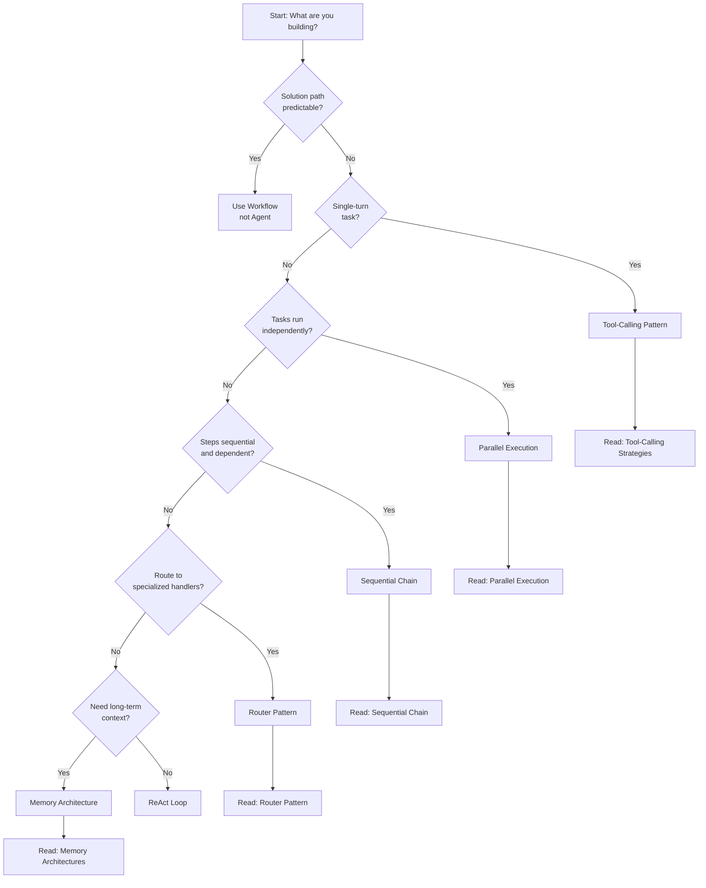

# Decision Tree: Which Pattern Do I Need?

> A practical flowchart to select the right agent pattern for your use case

## Quick Decision Path

Answer these questions in order to find your pattern:

### 1️⃣ Is the solution path predictable?

**Can you write out all the steps ahead of time?**

- ✅ **YES** → You don't need an agent. Use a **deterministic workflow** (if-then logic, state machines).

  - Example: E-commerce checkout flow
  - Tools: Step Functions, Temporal, n8n

- ❌ **NO** → Continue to question 2

---

### 2️⃣ Is it a single-turn task?

**Does it require only one LLM call or one action?**

- ✅ **YES** → You need a simple **tool-calling agent** or **RAG system**

  - Use: Direct LLM call with function calling
  - Example: "What's the weather?" → Call weather API → Return result
  - Go to: [Tool-Calling Strategies](../patterns/tool-calling-strategies.md)

- ❌ **NO** → Continue to question 3

---

### 3️⃣ Can tasks run independently?

**Are there multiple sub-tasks that don't depend on each other?**

- ✅ **YES** → Use **parallel execution pattern**

  - Run tasks concurrently to save time
  - Example: "Analyze this document for sentiment, key entities, and summary" (3 independent analyses)
  - Go to: [Parallel Execution](../patterns/parallel-execution.md)

- ❌ **NO** → Continue to question 4

---

### 4️⃣ Are the steps sequential and dependent?

**Does each step need the output from the previous step?**

- ✅ **YES** → Use **sequential chain pattern**

  - Linear pipeline where output flows to next step
  - Example: "Research topic → Write outline → Draft article → Proofread"
  - Go to: [Sequential Chain](../patterns/sequential-chain.md)

- ❌ **NO** → Continue to question 5

---

### 5️⃣ Do you need to route to specialized handlers?

**Do different inputs need different processing paths?**

- ✅ **YES** → Use **router pattern**

  - Central dispatcher routes to specialized agents/functions
  - Example: Customer support routing to billing/technical/returns
  - Go to: [Router Pattern](../patterns/router-pattern.md)

- ❌ **NO** → Continue to question 6

---

### 6️⃣ Does the agent need long-term context?

**Must it remember information across multiple interactions or steps?**

- ✅ **YES** → You need a **memory architecture**

  - Store and retrieve conversation history, facts, or working state
  - Example: Personal assistant that remembers preferences and past interactions
  - Go to: [Memory Architectures](../patterns/memory-architectures.md)

- ❌ **NO** → You likely need a **ReAct agent** (reason-act-observe loop)

---

## Pattern Selection Matrix

Quick reference table:

| Your Need         | Pattern             | Complexity | Cost | Use When                     |
| ----------------- | ------------------- | ---------- | ---- | ---------------------------- |
| Single API call   | Tool Calling        | ⭐         | $    | Simple function execution    |
| Linear steps      | Sequential Chain    | ⭐⭐       | $$   | Recipe-like workflows        |
| Independent tasks | Parallel Execution  | ⭐⭐       | $$   | Speed is priority            |
| Task routing      | Router              | ⭐⭐⭐     | $$$  | Multiple specialized domains |
| Context retention | Memory Architecture | ⭐⭐⭐⭐   | $$$$ | Conversational or stateful   |
| Complex reasoning | ReAct Loop          | ⭐⭐⭐⭐   | $$$$ | Open-ended problems          |

**Cost key:** $ = <10¢/task, $$ = 10-50¢, $$$ = 50¢-$2, $$$$ = $2+

---

## Real-World Examples

### Example 1: Customer Support Bot

**Requirements:**

- Understand user intent
- Route to correct department
- Access knowledge base
- Remember conversation history

**Decision path:**

1. Predictable? No (varied customer issues)
2. Single-turn? No (multi-step conversation)
3. Parallel? No (sequential interaction)
4. Sequential? Sort of, but varies by intent
5. **Routing?** ✅ **YES** → Router Pattern
6. **Memory?** ✅ **YES** → Add Memory Architecture

**Pattern:** Router + Memory

---

### Example 2: Research Assistant

**Requirements:**

- Search multiple sources
- Synthesize findings
- Generate report

**Decision path:**

1. Predictable? No (depends on query)
2. Single-turn? No (multi-step research)
3. **Parallel?** ✅ **YES** → Search multiple sources concurrently
4. **Sequential?** ✅ **YES** → Search → Synthesize → Generate

**Pattern:** Parallel Execution (for search) + Sequential Chain (for synthesis)

---

### Example 3: Code Review Agent

**Requirements:**

- Analyze code quality
- Check security issues
- Verify tests
- Suggest improvements

**Decision path:**

1. Predictable? Somewhat (but requires reasoning)
2. Single-turn? No
3. **Parallel?** ✅ **YES** → Run quality, security, test checks simultaneously

**Pattern:** Parallel Execution + Tool Calling

---

### Example 4: Trip Planning Agent

**Requirements:**

- Check flight availability
- Book hotel based on flight
- Recommend restaurants near hotel
- Create itinerary

**Decision path:**

1. Predictable? No (depends on availability)
2. Single-turn? No
3. Parallel? No (hotel depends on flight)
4. **Sequential?** ✅ **YES** → Flight → Hotel → Restaurants → Itinerary

**Pattern:** Sequential Chain + Tool Calling

---

## Common Combinations

Real-world agents often combine patterns:

### Router + Sequential Chains

- Route intent → Execute specific workflow
- Example: "Tech support" → Diagnose → Fix → Verify

### Parallel + Sequential

- Gather data in parallel → Process sequentially
- Example: Fetch 5 sources → Synthesize → Generate report

### Memory + Any Pattern

- Most production agents need memory
- Add memory layer to maintain context

---

## Anti-Patterns to Avoid

### ❌ Agent When Workflow Would Work

**Bad:** Using LLM to decide "if payment received, ship order"
**Good:** Simple if-then logic

**Why:** Agents add latency, cost, and unpredictability

---

### ❌ Sequential When Parallel Would Work

**Bad:** Calling 5 APIs one at a time
**Good:** Concurrent API calls

**Why:** Wastes time; user waits 5x longer

---

### ❌ Complex Agent for Simple Tasks

**Bad:** Multi-agent system for "translate this text"
**Good:** Direct API call to translation LLM

**Why:** Over-engineering kills performance and budget

---

## Start Simple, Add Complexity

**Best practice:** Start with the simplest pattern, then upgrade:

1. **Try tool calling** - Most tasks start here
2. **Add sequencing** - If you need ordered steps
3. **Add parallelism** - If you have independent tasks
4. **Add routing** - If you have multiple domains
5. **Add memory** - If you need context
6. **Add hierarchy** - Only for very complex systems

---

## Next Steps

1. **Identified your pattern?** → Jump to the specific pattern documentation
2. **Need multiple patterns?** → Read [Tool-Calling Strategies](../patterns/tool-calling-strategies.md) first (foundational)
3. **Still unsure?** → Review [What is an Agent?](./what-is-an-agent.md) or check [Case Studies](../case-studies/)

---

## Decision Tree Flowchart

**Can't see the flowchart?** Use the questions above - same logic, more detail.
