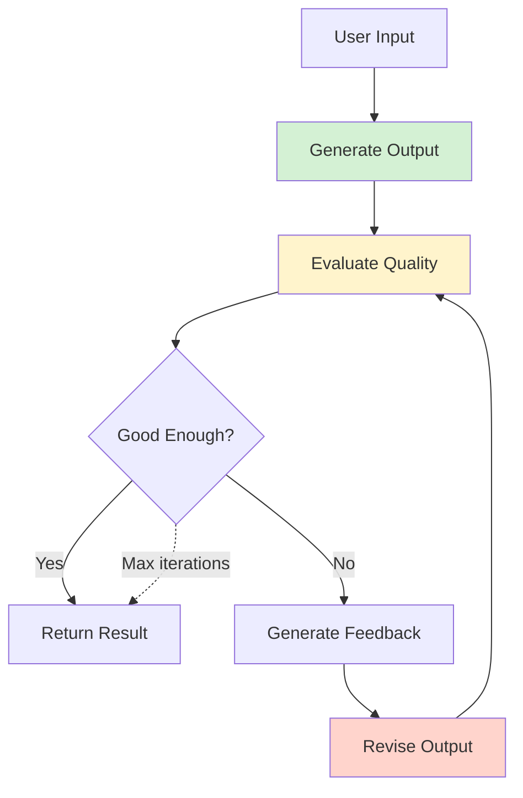

# Feedback Loop Pattern

> Self-improving agents that evaluate their output, receive feedback, and iterate toward better results

## When to Use

**Perfect for:**

- Quality-critical tasks requiring refinement
- Creative tasks that benefit from iteration (writing, design, code)
- Tasks where "good enough" isn't good enough
- Self-correction and error recovery
- Learning from mistakes within a single task

**Ideal scenarios:**

- "Write code, test it, fix bugs, repeat until tests pass"
- "Generate image, evaluate aesthetics, refine prompt, regenerate"
- "Draft email, check tone/clarity, revise, repeat until polished"
- "Solve math problem, verify answer, correct errors, re-solve"

## When NOT to Use

**❌ Avoid when:**

- **First attempt usually sufficient** - No need to iterate
- **Cost per iteration is high** - Each loop costs tokens/API calls
- **Time-sensitive tasks** - Iteration adds latency
- **No clear improvement metric** - Can't tell if iteration helped
- **Infinite loop risk** - Might never converge
- **Feedback is subjective** - Human feedback needed, not automated

**Cost trap:** Without max iterations, costs can balloon. 10 iterations = 10× base cost.

## Architecture Diagram



## Flow Breakdown

### Basic Feedback Loop

```python
def feedback_loop(task, max_iterations=5):
    output = generate_initial(task)

    for i in range(max_iterations):
        # Evaluate current output
        score, feedback = evaluate(output)

        # Check if good enough
        if score >= threshold:
            return output

        # Revise based on feedback
        output = revise(output, feedback)

    # Max iterations reached
    return output
```

### Example: Code Generation with Testing

**Iteration 1:**

```python
# Generate
code = llm.generate("Write function to sort list")

# Output
def sort_list(lst):
    return sorted(lst)

# Test
result = run_tests(code)
# ✅ Pass - return code
```

**Iteration 2 (if tests failed):**

```python
# Generate
code = llm.generate("Write function to calculate fibonacci")

# Output
def fib(n):
    return fib(n-1) + fib(n-2)  # ❌ No base case

# Test
result = run_tests(code)
# ❌ Fail: "RecursionError: maximum recursion depth exceeded"

# Feedback
feedback = "Add base case for n=0 and n=1"

# Revise
code = llm.generate(f"Fix this code: {code}\nError: {feedback}")

# Output
def fib(n):
    if n <= 1:
        return n
    return fib(n-1) + fib(n-2)

# Test
result = run_tests(code)
# ✅ Pass - return code
```

## Tradeoffs Table

| Aspect           | Pro                                  | Con                                      |
| ---------------- | ------------------------------------ | ---------------------------------------- |
| **Quality**      | Iterative refinement improves output | Diminishing returns after 3-5 iterations |
| **Cost**         | Only iterate when needed             | Can be 5-10× base cost                   |
| **Latency**      | Takes time to iterate                | User waits longer                        |
| **Robustness**   | Self-corrects errors                 | Might get stuck in loops                 |
| **Automation**   | Fully automated improvement          | Requires good evaluation function        |
| **Transparency** | Can show iteration history           | Complex to debug                         |

## Implementation Approaches

### Approach 1: Simple Loop with Scoring

```python
def improve_with_feedback(prompt, max_iterations=3):
    output = llm.generate(prompt)

    for i in range(max_iterations):
        score = evaluate_quality(output)

        if score >= 0.9:  # Good enough
            break

        feedback = generate_feedback(output, score)
        output = llm.generate(f"{prompt}\n\nPrevious attempt: {output}\nFeedback: {feedback}\nImproved version:")

    return output
```

### Approach 2: Critic-Actor Pattern

```python
class CriticActorLoop:
    def __init__(self):
        self.actor_llm = llm  # Generates output
        self.critic_llm = llm  # Evaluates output

    def run(self, task):
        output = self.actor_llm.generate(task)

        for i in range(5):
            # Critic evaluates
            critique = self.critic_llm.generate(f"Evaluate this output: {output}\nProvide specific feedback.")

            if "good" in critique.lower():
                break

            # Actor revises based on critique
            output = self.actor_llm.generate(f"Original task: {task}\nCurrent output: {output}\nCritique: {critique}\nRevised output:")

        return output
```

### Approach 3: Test-Driven Feedback (for code)

```python
def code_with_tests(spec, tests):
    code = llm.generate(f"Write code: {spec}")

    for attempt in range(5):
        # Run tests
        result = execute_tests(code, tests)

        if result.all_passed:
            return code

        # Generate fix based on failures
        error_msg = result.errors
        code = llm.generate(f"Fix this code:\n{code}\n\nErrors:\n{error_msg}")

    return code
```

### Approach 4: Gradient-Based Improvement

```python
def iterative_refinement(prompt, target_criteria):
    output = llm.generate(prompt)
    history = [output]

    for i in range(10):
        # Evaluate multiple criteria
        scores = {
            "clarity": evaluate_clarity(output),
            "accuracy": evaluate_accuracy(output),
            "completeness": evaluate_completeness(output)
        }

        # Find weakest dimension
        weakest = min(scores, key=scores.get)

        # Targeted improvement
        output = llm.generate(f"Improve the {weakest} of: {output}")
        history.append(output)

        # Check overall quality
        if all(score > 0.8 for score in scores.values()):
            break

    return output
```

## Real-world Example: Article Writing

**Task:** "Write article about climate change solutions"

**Iteration 1:**

```
Output: "Climate change is bad. We need to fix it with solar panels."

Evaluation:
- Clarity: 6/10 (too simplistic)
- Depth: 3/10 (lacks detail)
- Structure: 4/10 (no structure)

Feedback: "Add specific solutions, data, and structure with sections"
```

**Iteration 2:**

```
Output: "Climate Change Solutions
1. Renewable Energy - Solar, wind reduce emissions by 40%
2. Carbon Capture - Removes CO2 from atmosphere
3. Policy Changes - Carbon tax, regulations
4. Individual Actions - Reduce consumption"

Evaluation:
- Clarity: 8/10 (much better)
- Depth: 7/10 (good overview)
- Structure: 9/10 (clear sections)

Feedback: "Good structure. Add more detail on carbon capture technology."
```

**Iteration 3:**

```
Output: [Full article with detailed carbon capture section]

Evaluation:
- Clarity: 9/10
- Depth: 9/10
- Structure: 9/10

✅ Accepted - Quality threshold met
```

**Total cost:** $0.045 (3 iterations)
**Time:** 15 seconds

## Cost Analysis

**Per-iteration costs:**

| Iteration | Generate | Evaluate | Revise | Total      |
| --------- | -------- | -------- | ------ | ---------- |
| 1         | $0.015   | $0.003   | -      | $0.018     |
| 2         | $0.020   | $0.003   | $0.015 | $0.038     |
| 3         | $0.020   | $0.003   | $0.015 | $0.038     |
| **Total** |          |          |        | **$0.094** |

**Optimization strategies:**

1. **Early stopping** - Accept "good enough" rather than perfect
2. **Cheap evaluation** - Use heuristics before LLM evaluation
3. **Targeted revision** - Only revise the problematic parts
4. **Caching** - Don't regenerate unchanged sections

## Common Pitfalls

### 1. Infinite Loops

**Problem:** Never reaches "good enough"

```python
while not is_perfect(output):
    output = improve(output)  # ❌ Might loop forever
```

**Solution:** Max iterations mandatory

```python
for i in range(MAX_ITERATIONS):
    if is_good_enough(output):
        break
    output = improve(output)
```

### 2. Regression

**Problem:** Revision makes output worse

```python
Iteration 1: Score = 7/10
Iteration 2: Score = 5/10  # ❌ Got worse!
```

**Solution:** Track best output, revert if regression

```python
best_output = output
best_score = score

for i in range(iterations):
    new_output = revise(output)
    new_score = evaluate(new_output)

    if new_score > best_score:
        best_output = new_output
        best_score = new_score

    output = new_output  # Continue from here, but remember best

return best_output
```

### 3. Vague Feedback

**Problem:** Feedback doesn't help improvement

```python
Feedback: "Make it better"  # ❌ Not actionable
```

**Solution:** Specific, actionable feedback

```python
Feedback: "Add concrete examples in section 2. Remove redundant text in paragraph 3."
```

### 4. No Convergence Criteria

**Problem:** Don't know when to stop

```python
# ❌ Just iterate blindly
for i in range(10):
    output = improve(output)
```

**Solution:** Define success criteria

```python
def is_acceptable(output, criteria):
    return (
        criteria["length"] > 100 and
        criteria["readability_score"] > 60 and
        criteria["contains_examples"] == True
    )
```

### 5. Evaluation is Expensive

**Problem:** Evaluation costs more than generation

```python
output = llm.generate(prompt)  # $0.01
evaluation = expensive_llm.evaluate(output)  # $0.10 ← Too expensive!
```

**Solution:** Tiered evaluation

```python
# Cheap check first
if quick_heuristic_check(output):
    # Only use expensive evaluation if needed
    detailed_eval = expensive_llm.evaluate(output)
```

## Advanced Patterns

### Constitutional AI Feedback

Agent evaluates against principles:

```python
constitution = [
    "Be helpful and harmless",
    "Provide accurate information",
    "Respect user privacy"
]

def constitutional_feedback(output):
    violations = []
    for principle in constitution:
        if violates(output, principle):
            violations.append(f"Violates: {principle}")
    return violations
```

### Multi-Objective Optimization

Balance competing criteria:

```python
def multi_objective_evaluate(output):
    return {
        "accuracy": 0.9,
        "brevity": 0.6,  # Conflicts with detail
        "detail": 0.8,   # Conflicts with brevity
        "readability": 0.85
    }

# Weighted combination
overall_score = (
    0.4 * accuracy +
    0.2 * brevity +
    0.2 * detail +
    0.2 * readability
)
```

### Human-in-the-Loop

```python
def feedback_with_human(task):
    output = llm.generate(task)

    for i in range(3):
        # Show to human
        print(f"Current output: {output}")
        human_feedback = input("Feedback (or 'done'): ")

        if human_feedback == "done":
            break

        output = llm.generate(f"Revise based on: {human_feedback}\n\nCurrent: {output}")

    return output
```

## Testing & Validation

### Test Improvement Trajectory

```python
def test_feedback_improves():
    task = "Write clear explanation"
    scores = []

    output = generate(task)
    for i in range(5):
        scores.append(evaluate(output))
        output = revise(output)

    # Scores should generally increase
    assert scores[-1] >= scores[0]
```

### Test Convergence

```python
def test_reaches_threshold():
    output = feedback_loop(task, threshold=0.9)
    final_score = evaluate(output)
    assert final_score >= 0.9
```

## Production Considerations

### Adaptive Iteration Count

```python
def smart_iteration(task):
    if is_simple(task):
        max_iter = 2
    elif is_complex(task):
        max_iter = 7
    else:
        max_iter = 5

    return feedback_loop(task, max_iterations=max_iter)
```

### Cost Budgeting

```python
def budget_aware_loop(task, max_cost=0.10):
    total_cost = 0
    output = generate(task)

    while total_cost < max_cost:
        score, feedback = evaluate(output)
        total_cost += evaluation_cost

        if score >= threshold:
            break

        output = revise(output, feedback)
        total_cost += revision_cost

    return output, total_cost
```

### Monitoring

```json
{
  "task": "Write article",
  "iterations": [
    { "num": 1, "score": 0.6, "cost": 0.018 },
    { "num": 2, "score": 0.75, "cost": 0.038 },
    { "num": 3, "score": 0.92, "cost": 0.038 }
  ],
  "final_score": 0.92,
  "total_cost": 0.094,
  "converged": true
}
```

## References

- **Constitutional AI:** [Anthropic Paper](https://arxiv.org/abs/2212.08073)
- **RLHF:** [OpenAI Process](https://openai.com/research/learning-from-human-preferences)
- **Self-Refine:** [Paper](https://arxiv.org/abs/2303.17651) - LLM self-improvement

## Next Steps

- **Need code testing?** → See [Tool Calling](./tool-calling.md)
- **Need specialized agents?** → See [Router Agent](./router-agent.md)
- **Production concerns?** → See [Cost Optimization](../production/cost-optimization.md)
