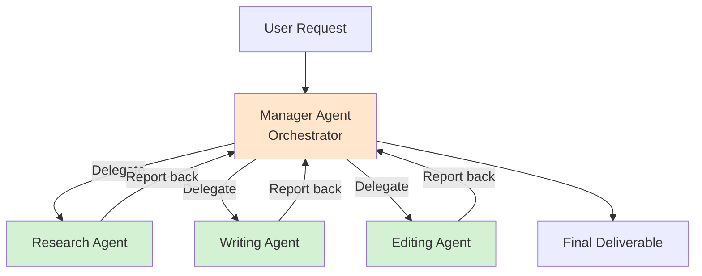

# Hierarchical Agents Pattern

> Manager agents coordinate worker agents in a multi-level organizational structure - delegation at scale

## When to Use

**Perfect for:**

- Complex projects requiring multiple specialized sub-tasks
- Coordinating teams of specialized agents
- Breaking down large problems into manageable pieces
- Delegating subtasks while maintaining oversight
- Projects with clear deliverables and milestones

**Ideal scenarios:**

- "Plan and execute a marketing campaign" (manager → content, design, distribution agents)
- "Build a software feature" (manager → research, code, test, document agents)
- "Write research report" (manager → data collection, analysis, writing agents)
- "Event planning" (manager → venue, catering, invitations, logistics agents)

## When NOT to Use

**❌ Avoid when:**

- **Simple sequential tasks** - Use sequential chain (less overhead)
- **No natural delegation** - Single agent can handle it all
- **Tight latency requirements** - Multiple coordination steps add delay
- **Cost is primary concern** - Manager layer adds overhead
- **Flat structure works** - Router pattern simpler for peer specialists

**Cost trap:** Manager + N workers = (N+1) agent calls. Coordination overhead can exceed 50% of total cost.

## Architecture Diagram



## Flow Breakdown

### Manager Agent Responsibilities

1. **Planning** - Break down task into subtasks
2. **Delegation** - Assign subtasks to worker agents
3. **Coordination** - Manage dependencies, ordering
4. **Quality Control** - Review worker outputs
5. **Synthesis** - Combine results into final deliverable

### Worker Agent Responsibilities

1. **Execute specialized task**
2. **Report progress/completion**
3. **Request clarification if needed**

### Example Execution

**Task:** "Create a blog post about AI safety"

**Manager Agent Plan:**

```
Step 1: Research (research_agent)
Step 2: Create outline (planning_agent)
Step 3: Write draft (writing_agent)
Step 4: Proofread (editing_agent)
Step 5: Format for publication (formatting_agent)
```

**Manager delegates to Worker 1 (Research Agent):**

```python
manager.delegate(
    agent="research_agent",
    task="Research AI safety: key challenges, recent developments, expert opinions",
    deadline="5 seconds"
)
```

**Research Agent executes and reports:**

```
Research complete. Key findings:
- Alignment problem
- Value learning challenges
- Recent breakthroughs in RLHF
- Expert consensus on timeline
```

**Manager delegates to Worker 2 (Writing Agent):**

```python
manager.delegate(
    agent="writing_agent",
    task="Write 1000-word article using research: [research output]",
    style="informative, accessible"
)
```

**Manager continues through all workers, then synthesizes final result.**

## Tradeoffs Table

| Aspect             | Pro                                | Con                                         |
| ------------------ | ---------------------------------- | ------------------------------------------- |
| **Scalability**    | Can coordinate many workers        | Communication overhead grows with team size |
| **Specialization** | Each worker optimized              | More agents to maintain                     |
| **Modularity**     | Easy to swap workers               | Requires well-defined interfaces            |
| **Cost**           | Parallel worker execution possible | Manager coordination adds cost              |
| **Quality**        | Manager reviews worker output      | Manager can become bottleneck               |
| **Latency**        | Can parallelize independent tasks  | Coordination steps add delay                |
| **Complexity**     | Mirrors real org structures        | More failure points                         |

## Real-world Example: Software Feature Implementation

**Manager Agent:** "Implement user authentication"

**Plan generated by manager:**

```
1. requirements_agent: Define auth requirements
2. design_agent: Design architecture
3. code_agent: Implement auth logic
4. test_agent: Write and run tests
5. docs_agent: Create documentation
```

**Execution:**

```python
class ManagerAgent:
    def __init__(self):
        self.workers = {
            "requirements": RequirementsAgent(),
            "design": DesignAgent(),
            "code": CodeAgent(),
            "test": TestAgent(),
            "docs": DocsAgent()
        }

    def execute(self, task):
        # Step 1: Create plan
        plan = self.create_plan(task)

        # Step 2: Execute plan with workers
        results = {}
        for step in plan:
            worker = self.workers[step["agent"]]
            context = {**results}  # Pass previous results
            output = worker.execute(step["task"], context)
            results[step["agent"]] = output

            # Step 3: Quality check
            if not self.validate(output):
                output = self.request_revision(worker, output)

            results[step["agent"]] = output

        # Step 4: Synthesize
        return self.synthesize(results)

    def create_plan(self, task):
        prompt = f"""
Create a plan to accomplish: {task}

Available workers:
- requirements_agent: Define specs
- design_agent: Architecture design
- code_agent: Implementation
- test_agent: Testing
- docs_agent: Documentation

Return plan as steps:"""

        return self.llm.generate(prompt)
```

**Cost:** ~$0.50 (manager + 5 workers)
**Time:** ~60 seconds total
**Output:** Complete feature with code, tests, and docs

## Cost Analysis

**Example: Blog post creation**

| Agent               | Role           | Tokens    | Cost       |
| ------------------- | -------------- | --------- | ---------- |
| Manager (planning)  | Create plan    | 500       | $0.005     |
| Research Agent      | Gather info    | 2000      | $0.020     |
| Manager (review)    | Check research | 300       | $0.003     |
| Writing Agent       | Draft article  | 3000      | $0.030     |
| Manager (review)    | Check draft    | 500       | $0.005     |
| Editing Agent       | Proofread      | 1500      | $0.015     |
| Manager (synthesis) | Final assembly | 400       | $0.004     |
| **Total**           |                | **8,200** | **$0.082** |

**Manager overhead:** ~20% of total cost (planning + reviews + synthesis)

**Optimization:**

- Reduce manager review frequency (trust workers more)
- Parallel execution where possible
- Cache manager plans for similar tasks

## Common Pitfalls

### 1. Micromanagement

**Problem:** Manager reviews every tiny detail

```python
# ❌ Too much oversight
for sentence in worker_output.split('.'):
    manager.validate(sentence)  # Excessive
```

**Solution:** Trust workers, review at milestones only

### 2. Poor Task Decomposition

**Problem:** Tasks not actually independent

```python
# ❌ Can't parallelize - B needs A's output
plan = [
    ("worker_a", "Research topic"),
    ("worker_b", "Write about topic")  # Depends on A!
]
# But manager tries to run in parallel
```

**Solution:** Dependency graph, topological sorting

### 3. Context Loss

**Problem:** Workers don't have enough context

```python
# ❌ Worker missing critical info
manager.delegate("writing_agent", "Write the article")
# What article? What style? What length?
```

**Solution:** Pass full context to workers

### 4. No Conflict Resolution

**Problem:** Workers produce conflicting outputs

```python
research_agent: "Data shows X is true"
expert_agent: "X is actually false"
manager: "???"  # No resolution strategy
```

**Solution:** Manager mediates, requests clarification, or makes decision

### 5. Bottleneck Manager

**Problem:** All workers wait for manager approval

```python
worker_1 completes → waits for manager
worker_2 completes → waits for manager
worker_3 completes → waits for manager
# Manager reviews serially (slow)
```

**Solution:** Async reviews, batch approvals, or autonomous workers

## Advanced Patterns

### Multi-Level Hierarchy

```
CEO Agent
├── VP Engineering
│   ├── Backend Team Lead
│   │   ├── API Developer
│   │   └── Database Developer
│   └── Frontend Team Lead
│       ├── UI Developer
│       └── UX Developer
└── VP Marketing
    ├── Content Manager
    └── Social Media Manager
```

### Peer Review Pattern

Workers review each other's output before manager:

```python
draft = writing_agent.write()
review = editing_agent.review(draft)
final = writing_agent.revise(draft, review)
manager.approve(final)
```

### Swarm Intelligence

Manager coordinates but doesn't dictate:

```python
# Workers self-organize
workers = [agent1, agent2, agent3]
while not task_complete:
    for worker in workers:
        worker.observe_environment()
        worker.decide_action()
        worker.execute()
    manager.evaluate_progress()
```

## Testing & Validation

### Unit Test Workers

```python
def test_research_agent():
    agent = ResearchAgent()
    result = agent.execute("AI safety", context={})
    assert "alignment" in result
    assert len(result) > 100
```

### Integration Test Manager

```python
def test_manager_delegation():
    manager = ManagerAgent()
    result = manager.execute("Write blog post about AI")
    assert result["research"] is not None
    assert result["draft"] is not None
    assert result["final"] is not None
```

### Test Error Handling

```python
def test_worker_failure():
    manager = ManagerAgent()
    # Mock worker to fail
    with patch('workers.research_agent.execute', side_effect=Exception):
        result = manager.execute("task")
        assert result["fallback_used"] == True
```

## Production Considerations

### Observability

```json
{
  "task_id": "abc123",
  "manager": "content_manager",
  "plan": [
    { "step": 1, "agent": "research", "status": "complete" },
    { "step": 2, "agent": "writing", "status": "in_progress" },
    { "step": 3, "agent": "editing", "status": "pending" }
  ],
  "total_cost": 0.082,
  "elapsed_time": 45,
  "bottlenecks": ["writing_agent slow"]
}
```

### Dynamic Worker Allocation

```python
# Scale workers based on load
if queue_size > 10:
    manager.spawn_worker("research_agent")
elif queue_size < 3:
    manager.retire_worker("research_agent")
```

### Checkpointing

Save progress in case of failure:

```python
manager.execute(task)
# After each worker completes
manager.checkpoint()  # Save state
# If crash, can resume
manager.resume_from_checkpoint()
```

## References

- **Multi-Agent Systems:** [Wooldridge Book](https://www.wiley.com/en-us/An+Introduction+to+MultiAgent+Systems%2C+2nd+Edition-p-9780470519462)
- **AutoGPT:** [GitHub](https://github.com/Significant-Gravitas/AutoGPT) - Autonomous agent system
- **MetaGPT:** [Paper](https://arxiv.org/abs/2308.00352) - Software company simulation

## Next Steps

- **Need routing only?** → See [Router Agent](./router-agent.md)
- **Simpler workflows?** → See [Sequential Chain](./sequential-chain.md)
- **Production concerns?** → See [Error Handling](../production/error-handling.md)
