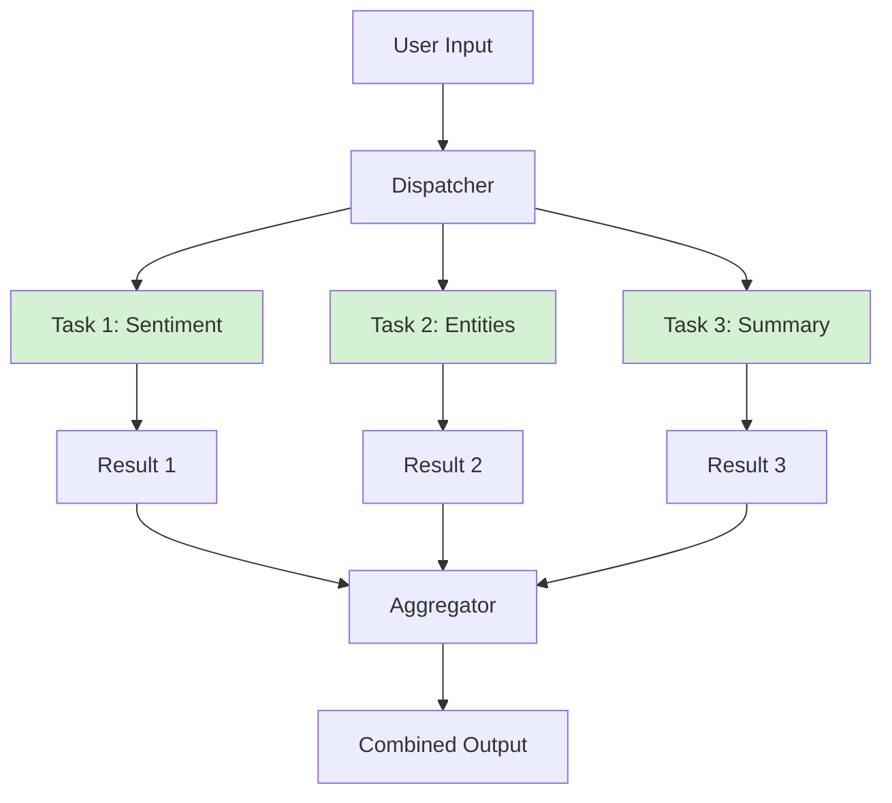

# Parallel Execution Pattern

> Execute multiple independent tasks simultaneously - maximize speed through concurrency

## When to Use

**Perfect for:**

- Independent tasks that don't depend on each other
- Gathering data from multiple sources concurrently
- Running multiple analyses on the same input
- Batch processing with no inter-task dependencies
- Time-sensitive operations where latency matters

**Ideal scenarios:**

- "Analyze this document for sentiment, entities, and key phrases" (3 independent analyses)
- "Search Google, Bing, and DuckDuckGo simultaneously" (multiple APIs)
- "Translate this text to Spanish, French, and German" (parallel translations)
- "Check inventory across 10 warehouses" (concurrent database queries)

## When NOT to Use

**❌ Avoid when:**

- **Tasks have dependencies** - Use sequential chain if output of task A is needed for task B
- **Shared state modifications** - Race conditions can cause bugs
- **Rate limits are tight** - Bursting requests may hit API limits
- **Cost per task is high** - No benefit if you're paying per call anyway
- **Results need ordering** - Parallel execution has non-deterministic completion order
- **Single slow task bottlenecks** - Overall time = slowest task, no benefit if one task dominates

**Cost trap:** Parallelism doesn't reduce cost - still pay for all tasks. Only saves time.

## Architecture Diagram



## Flow Breakdown

**Sequential vs Parallel:**

```
Sequential: Task1 (2s) → Task2 (2s) → Task3 (2s) = 6s total

Parallel:   Task1 (2s) ─┐
            Task2 (2s) ─┤ → Aggregate = 2s total
            Task3 (2s) ─┘
```

**Speedup = Num_tasks (in ideal case)**

### Implementation

```python
import asyncio

async def task_1(data):
    await asyncio.sleep(2)  # Simulates API call
    return {"sentiment": "positive"}

async def task_2(data):
    await asyncio.sleep(2)
    return {"entities": ["AI", "technology"]}

async def task_3(data):
    await asyncio.sleep(2)
    return {"summary": "Article about AI advances"}

async def parallel_execution(data):
    # Run all tasks concurrently
    results = await asyncio.gather(
        task_1(data),
        task_2(data),
        task_3(data)
    )

    # Combine results
    return {
        "sentiment": results[0]["sentiment"],
        "entities": results[1]["entities"],
        "summary": results[2]["summary"]
    }

# Run
result = asyncio.run(parallel_execution("input text"))
```

## Tradeoffs Table

| Aspect             | Pro                               | Con                                             |
| ------------------ | --------------------------------- | ----------------------------------------------- |
| **Latency**        | Up to N× faster (N = num tasks)   | No benefit if tasks have dependencies           |
| **Cost**           | Same total cost as sequential     | No cost savings, only time savings              |
| **Resource usage** | Higher concurrent load            | Can overwhelm systems (CPU, memory, API limits) |
| **Complexity**     | Simple conceptually               | Error handling more complex                     |
| **Reliability**    | Partial results possible          | One failure can block all results               |
| **Debugging**      | Harder (non-deterministic timing) | Race conditions possible                        |
| **Scalability**    | Excellent for horizontal scaling  | Limited by shared resource bottlenecks          |

## Real-world Example: Product Research Agent

**Task:** Research a product across multiple sources

**Tasks (can run in parallel):**

1. Search Amazon reviews
2. Search Reddit discussions
3. Search YouTube reviews
4. Check price comparison sites
5. Analyze expert reviews

**Sequential time:** 5 tasks × 3 seconds = 15 seconds
**Parallel time:** max(3 seconds) = 3 seconds
**Speedup:** 5×

```python
async def research_product(product_name):
    tasks = [
        search_amazon_reviews(product_name),
        search_reddit(product_name),
        search_youtube(product_name),
        search_price_sites(product_name),
        search_expert_reviews(product_name)
    ]

    results = await asyncio.gather(*tasks, return_exceptions=True)

    # Handle failures gracefully
    valid_results = [r for r in results if not isinstance(r, Exception)]

    # Aggregate
    return {
        "amazon_reviews": valid_results[0] if len(valid_results) > 0 else None,
        "reddit": valid_results[1] if len(valid_results) > 1 else None,
        # ... etc
    }
```

## Cost Analysis

| Component     | Sequential        | Parallel          | Savings         |
| ------------- | ----------------- | ----------------- | --------------- |
| **Time**      | 15 seconds        | 3 seconds         | 80% reduction   |
| **Cost**      | $0.15 (5 × $0.03) | $0.15 (5 × $0.03) | $0 (no savings) |
| **API calls** | 5 calls           | 5 calls           | 0 (same)        |

**Key insight:** Parallelism trades **cost for speed** - you pay the same but get results faster.

**When worth it:**

- User is waiting (latency matters)
- Time-sensitive decisions
- High-value tasks (cost justified)

**When not worth it:**

- Batch processing (no one waiting)
- Cost-constrained environments
- Rate limits punish bursts

## Common Pitfalls

### 1. Race Conditions

**Problem:** Tasks modify shared state

```python
counter = 0

async def increment():
    global counter
    temp = counter
    await asyncio.sleep(0.1)
    counter = temp + 1  # ❌ Lost updates!

await asyncio.gather(*[increment() for _ in range(5)])
# Expected: counter = 5
# Actual: counter = 1 (race condition)
```

**Solution:** Use locks or avoid shared state

### 2. Ignoring Partial Failures

**Problem:** One task fails, throw away all results

```python
results = await asyncio.gather(task1(), task2(), task3())
# ❌ If any task raises exception, gather raises and no results returned
```

**Solution:** Use `return_exceptions=True`

```python
results = await asyncio.gather(*tasks, return_exceptions=True)
valid = [r for r in results if not isinstance(r, Exception)]
```

### 3. Overwhelming External APIs

**Problem:** 100 parallel calls hit rate limit

```python
tasks = [call_api(item) for item in range(100)]
await asyncio.gather(*tasks)  # ❌ Rate limit exceeded
```

**Solution:** Semaphore to limit concurrency

```python
semaphore = asyncio.Semaphore(10)  # Max 10 concurrent

async def limited_call(item):
    async with semaphore:
        return await call_api(item)

tasks = [limited_call(item) for item in range(100)]
```

### 4. No Timeout Handling

**Problem:** One slow task blocks everything

```python
await asyncio.gather(fast_task(), slow_task(), fast_task())
# ❌ Waits for slow_task forever
```

**Solution:** Set timeouts

```python
await asyncio.gather(
    asyncio.wait_for(task1(), timeout=5),
    asyncio.wait_for(task2(), timeout=5),
    asyncio.wait_for(task3(), timeout=5)
)
```

## Common Pitfalls (continued)

### 5. Order Assumption

**Problem:** Assuming results return in order

```python
results = await asyncio.gather(task_a(), task_b(), task_c())
first_result = results[0]  # ❌ Assumes task_a finished first
```

**Solution:** Use dictionaries with keys

```python
results = await asyncio.gather(
    task_a(),
    task_b(),
    task_c()
)
return {
    "a": results[0],
    "b": results[1],
    "c": results[2]
}
```

## Advanced Patterns

### Dynamic Task Generation

Generate tasks based on initial results:

```python
# Phase 1: Parallel search
initial_results = await asyncio.gather(
    search_google(query),
    search_bing(query)
)

# Phase 2: Parallel deep-dive on each result
deep_dive_tasks = [
    analyze_url(url) for result in initial_results for url in result["urls"]
]
detailed_results = await asyncio.gather(*deep_dive_tasks)
```

### Map-Reduce Pattern

```python
# Map phase (parallel)
mapped = await asyncio.gather(*[process_chunk(chunk) for chunk in chunks])

# Reduce phase (sequential or parallel)
final_result = reduce(combine, mapped)
```

### Priority-based Execution

Execute high-priority tasks first, then fill with lower priority:

```python
high_priority = await asyncio.gather(*high_priority_tasks)
low_priority = await asyncio.gather(*low_priority_tasks)
```

## Production Considerations

### Monitoring

```python
import time

async def monitored_task(name, task_fn):
    start = time.time()
    try:
        result = await task_fn()
        duration = time.time() - start
        log(f"{name} completed in {duration}s")
        return result
    except Exception as e:
        log(f"{name} failed: {e}")
        raise

tasks = [monitored_task("task1", task1), monitored_task("task2", task2)]
```

### Rate Limiting

```python
from aiolimiter import AsyncLimiter

limiter = AsyncLimiter(10, 1)  # 10 requests per second

async def rate_limited_task(data):
    async with limiter:
        return await call_api(data)
```

### Retry Logic

```python
from tenacity import retry, stop_after_attempt, wait_exponential

@retry(stop=stop_after_attempt(3), wait=wait_exponential(multiplier=1, min=1, max=10))
async def resilient_task(data):
    return await potentially_failing_api_call(data)
```

## References

- **Python asyncio:** [Docs](https://docs.python.org/3/library/asyncio.html)
- **Concurrent Futures:** [Docs](https://docs.python.org/3/library/concurrent.futures.html)
- **Aiohttp (async HTTP):** [Docs](https://docs.aiohttp.org/)

## Next Steps

- **Need sequential dependencies?** → See [Sequential Chain](./sequential-chain.md)
- **Need task routing?** → See [Router Agent](./router-agent.md)
- **Production concerns?** → See [Rate Limiting](../production/rate-limiting-strategies.md)
