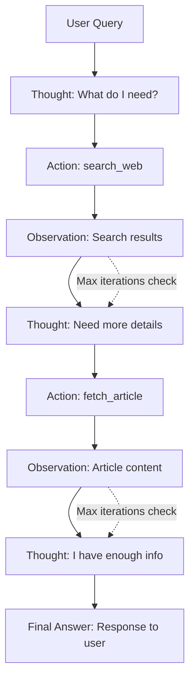

# ReAct Pattern (Reasoning + Acting)

> Iterative loop where agents reason about what to do, take action, observe results, and repeat

## When to Use

**Perfect for:**

- Open-ended problems requiring multi-step reasoning
- Tasks where the solution path is unknown upfront
- Research and exploration (gather info, synthesize, iterate)
- Debugging and troubleshooting (try fixes, check results)
- Complex decision-making with external data dependencies

**Ideal scenarios:**

- "Research the best budget laptop for video editing" → Search, compare, refine
- "Debug why the API is returning 500 errors" → Check logs, test endpoints, diagnose
- "Plan a 5-day trip to Japan" → Find flights, book hotels, plan itinerary
- "Analyze this dataset and find insights" → Explore, visualize, hypothesize, validate

## When NOT to Use

**❌ Avoid when:**

- **Path is predictable** - Use sequential chain instead (cheaper, faster)
- **Single-turn task** - Simple tool calling is sufficient
- **Strict cost budget** - ReAct can loop indefinitely, burning tokens
- **Latency sensitive** - Multiple LLM calls add significant delay
- **High accuracy required** - Reasoning loops can drift or hallucinate
- **Simple lookups** - Overkill for "What's 2+2?" or "Find customer #123"

**Cost trap:** Without max iterations, ReAct can loop 10+ times on complex queries, costing $1+ per request.

## Architecture Diagram



## Flow Breakdown

### Core Loop Structure

**Format:**

```
Thought: [Internal reasoning about what to do next]
Action: [Tool to invoke]
Action Input: [Arguments for tool]
Observation: [Result from tool execution]
... (repeat until goal achieved)
Final Answer: [Response to user]
```

### Example Execution

**User query:** "What's the population of the capital of France?"

**Iteration 1:**

```
Thought: I need to know the capital of France first
Action: search_web
Action Input: "capital of France"
Observation: Paris is the capital of France
```

**Iteration 2:**

```
Thought: Now I need the population of Paris
Action: search_web
Action Input: "population of Paris 2026"
Observation: Paris has approximately 2.1 million residents
```

**Final:**

```
Thought: I have the answer
Final Answer: The capital of France is Paris, with a population of approximately 2.1 million.
```

## Implementation Details

### Prompt Template

```python
prompt = """
You are an assistant that uses tools to answer questions.

You have access to these tools:
{tool_descriptions}

Use this format:

Thought: [Reason about what to do]
Action: [tool_name]
Action Input: [arguments]
Observation: [tool result - will be provided]

Repeat Thought/Action/Observation as needed.

When you have the final answer:
Thought: I have enough information
Final Answer: [your response]

Question: {user_query}
"""
```

### Orchestrator Loop

```python
def react_loop(query, tools, max_iterations=10):
    context = []

    for i in range(max_iterations):
        # Get LLM reasoning
        prompt = build_prompt(query, context, tools)
        response = llm.generate(prompt)

        # Parse output
        if "Final Answer:" in response:
            return extract_answer(response)

        thought = extract_thought(response)
        action = extract_action(response)
        action_input = extract_action_input(response)

        # Execute tool
        observation = execute_tool(action, action_input)

        # Add to context
        context.append({
            "thought": thought,
            "action": action,
            "action_input": action_input,
            "observation": observation
        })

    # Max iterations reached
    return "Unable to complete task within iteration limit"
```

### Parsing Strategies

**Regex-based:**

```python
import re

def extract_action(response):
    match = re.search(r"Action:\s*(\w+)", response)
    return match.group(1) if match else None

def extract_action_input(response):
    match = re.search(r"Action Input:\s*(.+?)(?:\n|$)", response)
    return match.group(1).strip() if match else None
```

**Problem:** LLM may not follow format exactly (extra text, typos)

**Robust parsing:**

```python
def parse_react_output(response):
    lines = response.split('\n')
    result = {}

    for line in lines:
        if line.startswith("Thought:"):
            result["thought"] = line[8:].strip()
        elif line.startswith("Action:"):
            result["action"] = line[7:].strip()
        elif line.startswith("Action Input:"):
            result["action_input"] = line[13:].strip()

    return result
```

## Tradeoffs Table

| Aspect          | Pro                            | Con                                 |
| --------------- | ------------------------------ | ----------------------------------- |
| **Flexibility** | Handles unpredictable problems | No guarantees it will find solution |
| **Cost**        | Only uses tokens needed        | Can loop many times ($1+ per query) |
| **Latency**     | Self-corrects errors           | 5-30s for complex tasks             |
| **Accuracy**    | Can gather comprehensive info  | May get stuck or hallucinate        |
| **Debugging**   | Full reasoning trace visible   | Hard to predict behavior            |
| **Scalability** | Stateless (context in prompt)  | Context grows with each iteration   |
| **Reliability** | Retries failed actions         | Infinite loops possible             |

## Real-world Example: Research Assistant

**Task:** "Find the best noise-canceling headphones under $300"

**Execution trace:**

**Iteration 1:**

```
Thought: I should search for top-rated noise-canceling headphones
Action: search_web
Action Input: "best noise canceling headphones 2026"
Observation: Top results: Sony WH-1000XM6 ($349), Bose QC45 ($279), Apple AirPods Max ($549)
```

**Iteration 2:**

```
Thought: Bose QC45 is under budget. Let me check detailed reviews
Action: fetch_article
Action Input: "https://reviews.com/bose-qc45"
Observation: Rating: 4.5/5. Pros: Great ANC, comfortable. Cons: Average battery life (24hrs)
```

**Iteration 3:**

```
Thought: Let me check if there are other options under $300
Action: search_web
Action Input: "noise canceling headphones under $300 2026"
Observation: Also recommended: Anker Soundcore Space One ($99), Sennheiser Momentum 4 ($299)
```

**Iteration 4:**

```
Thought: Let me compare the Sennheiser to the Bose
Action: fetch_article
Action Input: "https://reviews.com/sennheiser-momentum-4"
Observation: Rating: 4.7/5. Pros: 60hr battery, excellent sound. Cons: Bulkier design
```

**Final:**

```
Thought: I have enough information to recommend
Final Answer: For noise-canceling headphones under $300, I recommend:

1. Sennheiser Momentum 4 ($299) - Best overall with 60hr battery and 4.7/5 rating
2. Bose QC45 ($279) - Most comfortable with strong ANC, but shorter battery (24hrs)
3. Anker Soundcore Space One ($99) - Budget option if cost is primary concern

The Sennheiser offers the best value at your budget limit.
```

**Cost:** ~5,000 tokens ($0.05 at $0.01/1K)

## Cost Analysis

**Per-iteration breakdown:**

| Component                        | Token Count      | Cost (@$0.01/1K) |
| -------------------------------- | ---------------- | ---------------- |
| System prompt + tools            | 500 tokens       | $0.005           |
| Previous context (per iteration) | 200 tokens       | $0.002           |
| User query                       | 50 tokens        | $0.0005          |
| LLM thought + action             | 150 tokens       | $0.0015          |
| Tool result                      | 300 tokens       | $0.003           |
| **Total per iteration**          | **1,200 tokens** | **$0.012**       |

**Full task cost:**

- 3 iterations: ~3,600 tokens = $0.036
- 5 iterations: ~6,000 tokens = $0.06
- 10 iterations: ~12,000 tokens = $0.12

**Optimization strategies:**

1. **Max iterations limit** - Force stop after N loops
2. **Summarize observations** - Compress tool results before adding to context
3. **Early stopping** - Detect when goal is achieved
4. **Use cheaper models** - GPT-3.5 for reasoning, GPT-4 for final answer

## Common Pitfalls

### 1. Infinite Loops

**Problem:** Agent repeats same action indefinitely

```
Thought: I should search
Action: search_web
Observation: [results]
Thought: I should search again  ← Repeats
Action: search_web
...
```

**Solution:** Track action history, detect cycles, force different approach

### 2. Format Breaking

**Problem:** LLM doesn't follow Thought/Action format

```
Let me search for that information...  ← No "Thought:" prefix
```

**Solution:** Strict parsing with retries, few-shot examples in prompt

### 3. Hallucinated Tool Names

**Problem:** LLM invents non-existent tools

```
Action: super_search_engine  ← Doesn't exist
```

**Solution:** Validate tool names, provide clear error, ask LLM to retry

### 4. Context Overflow

**Problem:** After many iterations, context exceeds token limit

```
Iteration 1: 1K tokens
Iteration 5: 5K tokens
Iteration 10: 10K tokens ← Approaching limit
```

**Solution:** Summarize older observations, drop least relevant context

### 5. Premature Stopping

**Problem:** LLM gives final answer with incomplete info

```
Thought: I think I know the answer
Final Answer: [incorrect guess]
```

**Solution:** Prompt engineering ("Be thorough. Search multiple sources.")

### 6. Tool Errors Not Handled

**Problem:** Tool fails, LLM gets confused

```
Action: fetch_url
Observation: ERROR: 404 Not Found  ← LLM doesn't know what to do
```

**Solution:** Return structured errors with recovery hints

```
Observation: {"error": "Page not found", "suggestion": "Try searching instead"}
```

### 7. No Progress Tracking

**Problem:** Can't tell if agent is making progress
**Solution:** Structured logging, trace visualization

## Advanced Patterns

### Self-Reflection

Agent evaluates its own reasoning:

```
Thought: I searched for X and found Y
Reflection: Is this result reliable? Let me verify with another source
Action: cross_check_source
```

### Plan-and-Execute Hybrid

Combine planning with ReAct:

```
Initial Thought: Let me plan the steps
Plan:
  1. Search for options
  2. Compare top 3
  3. Check reviews
  4. Recommend best

[Now execute plan using ReAct loop]
```

### Multi-Tool Parallelism

Execute multiple actions simultaneously:

```
Thought: I need data from 3 sources
Action: parallel_execute
Action Input: [search_web("X"), fetch_url("Y"), query_db("Z")]
Observation: [results from all 3]
```

## Prompt Engineering Tips

### Better Thought Quality

```
❌ "Thought: I should search"
✅ "Thought: I need to find current pricing info. Searching product review sites."
```

### Explicit Tool Descriptions

```python
tools = [
    {
        "name": "search_web",
        "description": "Search the web for current information. USE THIS for recent data, news, or general research. Returns 5-10 relevant snippets."
    },
    {
        "name": "calculate",
        "description": "Evaluate mathematical expressions. USE THIS for any math, including percentages, conversions, or comparisons. Returns numeric result."
    }
]
```

### Few-Shot Examples

Include 1-2 example reasoning chains in prompt:

```
Example:
Question: What's the capital of France?
Thought: I need to search for France's capital
Action: search_web
Action Input: "capital of France"
Observation: Paris is the capital
Thought: I have the answer
Final Answer: The capital of France is Paris.

Now answer this:
Question: {user_query}
```

## Testing & Validation

### Test Cases

1. **Simple task** - Should complete in 1-2 iterations
2. **Complex task** - Requires 5+ iterations
3. **Impossible task** - Gracefully fails at max iterations
4. **Tool errors** - Recovers from failures
5. **Ambiguous query** - Asks clarifying questions
6. **Cyclical reasoning** - Detects and breaks loops

### Success Metrics

- **Completion rate** - % of tasks completed successfully
- **Avg iterations** - Lower is better (efficiency)
- **Token usage** - Cost per task
- **Time to completion** - Latency

## Production Considerations

### Max Iterations

Always set a limit:

```python
MAX_ITERATIONS = 10  # Adjust based on task complexity

if iteration >= MAX_ITERATIONS:
    return f"Task incomplete after {MAX_ITERATIONS} attempts. Last state: {context}"
```

### Observability

Log full reasoning trace:

```json
{
  "task_id": "abc123",
  "query": "Best laptops under $1000",
  "iterations": [
    {
      "num": 1,
      "thought": "I should search for laptop reviews",
      "action": "search_web",
      "action_input": "best laptops under $1000 2026",
      "observation": "...",
      "duration_ms": 1200
    }
  ],
  "final_answer": "...",
  "total_tokens": 4500,
  "cost": 0.045
}
```

### Error Recovery

```python
def execute_tool_with_retry(action, action_input, max_retries=3):
    for attempt in range(max_retries):
        try:
            return tools[action](action_input)
        except Exception as e:
            if attempt == max_retries - 1:
                return {"error": str(e), "suggestion": "Try a different approach"}
            time.sleep(2 ** attempt)  # Exponential backoff
```

### Context Summarization

After N iterations, compress history:

```python
if len(context) > 5:
    # Summarize oldest observations
    summary = llm.generate(f"Summarize: {context[:3]}")
    context = [{"summary": summary}] + context[3:]
```

## Comparison: ReAct vs Other Patterns

| Pattern              | Use Case               | Iterations | Cost |
| -------------------- | ---------------------- | ---------- | ---- |
| **Tool Calling**     | Single action          | 1          | $    |
| **ReAct**            | Multi-step reasoning   | 3-10       | $$$  |
| **Sequential Chain** | Predefined steps       | N (fixed)  | $$   |
| **Router**           | Dispatch to specialist | 1          | $    |

**When to upgrade from tool calling to ReAct:**

- Task requires exploring multiple paths
- Don't know exact sequence upfront
- Need self-correction based on intermediate results

## References

- **ReAct Paper:** [arXiv:2210.03629](https://arxiv.org/abs/2210.03629) - Original research
- **LangChain ReAct:** [Docs](https://python.langchain.com/docs/modules/agents/agent_types/react)
- **ReAct Prompting Guide:** [Learn Prompting](https://learnprompting.org/docs/advanced_applications/react)

## Next Steps

- **Need structured planning?** → See [Chain-of-Thought](./chain-of-thought.md)
- **Want predefined steps?** → See [Sequential Chain](./sequential-chain.md)
- **Need specialized agents?** → See [Router Agent](./router-agent.md)
- **Going to production?** → See [Error Handling](../production/error-handling.md)
