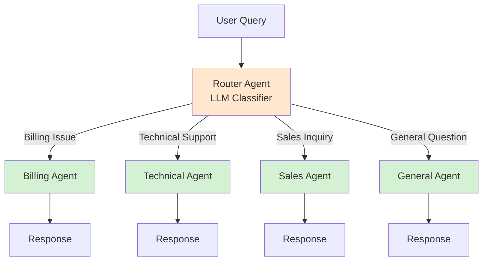
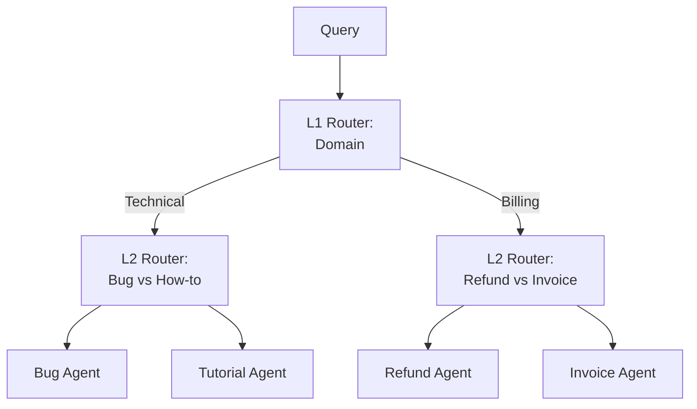

# Router Agent Pattern

> Central dispatcher that routes tasks to specialized agents or handlers based on intent, domain, or complexity

## When to Use

**Perfect for:**

- Multiple distinct domains or specializations
- Tasks requiring domain-specific expertise
- Customer service with different departments (billing, technical, sales)
- Content that needs specialized handling (code, creative writing, data analysis)
- Variable complexity levels (simple vs complex queries)

**Ideal scenarios:**

- "Route customer query to billing/technical/sales agent"
- "Classify query as code/math/general and route appropriately"
- "Send simple questions to cheap model, complex to expensive model"
- "Direct legal questions to legal agent, medical to medical agent"

## When NOT to Use

**❌ Avoid when:**

- **Single domain** - No need to route if everything handled the same way
- **Simple classification** - Direct if-then logic cheaper than LLM routing
- **Latency critical** - Routing adds extra LLM call (100-500ms)
- **Few specialized tasks** - Overkill for 2-3 simple tools (use direct tool calling)
- **Routing logic is obvious** - Regex or keyword matching is sufficient

**Cost trap:** Every request pays for routing decision + handler execution = 2× minimum cost.

## Architecture Diagram



## Flow Breakdown

### Step 1: Route Classification

```python
def route_query(user_query):
    routing_prompt = f"""
Classify this query into one category:
- billing: Payments, refunds, invoices
- technical: Bugs, errors, how-to
- sales: Pricing, features, demos
- general: Other questions

Query: {user_query}
Category:"""

    category = llm.generate(routing_prompt).strip().lower()
    return category
```

### Step 2: Dispatch to Handler

```python
agents = {
    "billing": billing_agent,
    "technical": technical_agent,
    "sales": sales_agent,
    "general": general_agent
}

category = route_query(user_query)
agent = agents.get(category, general_agent)  # Default to general
response = agent.handle(user_query)
```

### Complete Example

```python
# User query
query = "I was charged twice for my subscription"

# Step 1: Router decides
category = route_query(query)  # Returns: "billing"

# Step 2: Billing agent handles
billing_agent_prompt = f"""
You are a billing specialist. Help with this issue:
{query}

You have access to:
- check_subscription(user_id)
- process_refund(transaction_id, amount)
- view_invoices(user_id)
"""

response = billing_agent.handle(query)
# "I see duplicate charges. Processing refund for $29.99..."
```

## Tradeoffs Table

| Aspect              | Pro                                 | Con                                    |
| ------------------- | ----------------------------------- | -------------------------------------- |
| **Specialization**  | Each agent optimized for domain     | More agents to maintain                |
| **Cost**            | Can route to cheap/expensive models | Router adds overhead to every request  |
| **Latency**         | Fast once routed                    | Routing adds 100-500ms                 |
| **Accuracy**        | Domain experts more accurate        | Router misclassification causes errors |
| **Scalability**     | Easy to add new domains             | Router must know about all routes      |
| **Maintainability** | Modular, clear separation           | More moving parts                      |

## Real-world Example: Customer Support System

**Agents:**

1. **Billing Agent** - Handles payments, refunds, invoices
2. **Technical Agent** - Debugging, API errors, integration help
3. **Sales Agent** - Pricing, feature questions, demos
4. **Account Agent** - Password resets, profile updates

**Router Implementation:**

```python
class RouterAgent:
    def __init__(self):
        self.agents = {
            "billing": BillingAgent(),
            "technical": TechnicalAgent(),
            "sales": SalesAgent(),
            "account": AccountAgent()
        }

    def route(self, query):
        # Enhanced routing with examples
        prompt = f"""
Classify into: billing, technical, sales, or account

Examples:
"I need a refund" → billing
"API returning 500 error" → technical
"What's included in Pro plan?" → sales
"Reset my password" → account

Query: {query}
Category (one word):"""

        category = llm.generate(prompt, max_tokens=10).strip().lower()

        # Validate route
        if category not in self.agents:
            category = "technical"  # Default fallback

        return category

    def handle(self, query):
        category = self.route(query)
        agent = self.agents[category]

        # Log routing decision
        log(f"Routed to {category}: {query[:50]}...")

        return agent.handle(query)
```

**Usage:**

```python
router = RouterAgent()

queries = [
    "I was double-charged",
    "How do I integrate your API?",
    "What's your enterprise pricing?",
    "Forgot my password"
]

for q in queries:
    response = router.handle(q)
```

**Results:**

- "I was double-charged" → billing agent → Check transactions, process refund
- "How do I integrate your API?" → technical agent → Provide SDK docs, code examples
- "What's your enterprise pricing?" → sales agent → Share pricing, offer demo
- "Forgot my password" → account agent → Send reset link

## Cost Analysis

**Per-request breakdown:**

| Component        | Tokens    | Cost (@$0.01/1K) |
| ---------------- | --------- | ---------------- |
| Router prompt    | 200       | $0.002           |
| Router output    | 20        | $0.0002          |
| Specialist agent | 800       | $0.008           |
| **Total**        | **1,020** | **$0.0102**      |

**vs Direct approach (no routing):**

- Single general agent: 600 tokens = $0.006
- **Router overhead: +70% cost**

**When worth it:**

- Specialist accuracy justifies cost (fewer escalations, better UX)
- Can route simple queries to cheap models (GPT-3.5), complex to expensive (GPT-4)
- Domain knowledge significantly improves results

**Cost optimization:**

```python
def smart_route(query):
    # Quick keyword check first (free)
    if "refund" in query or "charge" in query:
        return "billing"
    elif "error" in query or "bug" in query:
        return "technical"

    # Only use LLM for ambiguous cases
    return llm_route(query)
```

## Common Pitfalls

### 1. Ambiguous Routing

**Problem:** Query could fit multiple categories

```
"I can't access my billing page" → billing or technical?
```

**Solution:** Hierarchical routing or multi-agent consultation

### 2. Router Drift

**Problem:** Router makes inconsistent decisions

```
"I need a refund" → billing (Monday)
"I need a refund" → sales (Tuesday)  # Inconsistent!
```

**Solution:** Few-shot examples in prompt, deterministic classification

### 3. Cold Start Problem

**Problem:** New agent types not recognized

```
# Add "legal" agent but router never routes to it
```

**Solution:** Update router prompt, retrain if using classifier

### 4. Routing Loops

**Problem:** Agent bounces query back to router

```
Billing agent: "This is a technical issue" → Routes to technical
Technical agent: "This is a billing issue" → Routes to billing ← Loop!
```

**Solution:** Max routing hops, escalation path

### 5. Over-specialization

**Problem:** 50 micro-agents for every edge case

```
- refund_agent
- refund_urgent_agent
- refund_international_agent
...
```

**Solution:** Limit to 5-10 broad categories, handle nuances within agents

## Advanced Patterns

### Hierarchical Routing



### Confidence-Based Routing

```python
def route_with_confidence(query):
    # Get confidence scores for each category
    scores = llm.classify(query, categories=["billing", "technical", "sales"])
    # scores = {"billing": 0.95, "technical": 0.03, "sales": 0.02}

    top_category, confidence = max(scores.items(), key=lambda x: x[1])

    if confidence < 0.7:
        # Low confidence - escalate to human or general agent
        return "human_escalation"

    return top_category
```

### Multi-Agent Collaboration

```python
def collaborative_route(query):
    # Route to multiple agents for complex queries
    category = route(query)

    if category == "complex":
        # Get input from multiple specialists
        billing_input = billing_agent.analyze(query)
        technical_input = technical_agent.analyze(query)

        # Coordinator synthesizes
        return coordinator_agent.synthesize([billing_input, technical_input])
```

## Testing & Validation

### Routing Accuracy Test

```python
test_cases = [
    ("I need a refund", "billing"),
    ("API error 500", "technical"),
    ("What's the price?", "sales"),
    ("Reset password", "account")
]

correct = 0
for query, expected in test_cases:
    actual = router.route(query)
    if actual == expected:
        correct += 1

accuracy = correct / len(test_cases)
print(f"Routing accuracy: {accuracy:.1%}")
```

### Confusion Matrix

Track where misrouting happens:

```
              Predicted
           B   T   S   A
Actual B  45   2   1   0   (Billing)
       T   3  38   0   1   (Technical)
       S   1   0  42   2   (Sales)
       A   0   1   1  40   (Account)
```

## Production Considerations

### Fallback Strategy

```python
def robust_route(query, max_retries=2):
    for attempt in range(max_retries):
        try:
            category = route(query)
            if category in valid_categories:
                return category
        except Exception as e:
            log(f"Routing error: {e}")

    # Ultimate fallback
    return "general"
```

### A/B Testing

```python
def route_with_experiment(query, user_id):
    if user_id % 2 == 0:
        # Control: Keyword-based routing
        category = keyword_route(query)
    else:
        # Treatment: LLM-based routing
        category = llm_route(query)

    log_experiment(user_id, category, "llm" if user_id % 2 else "keyword")
    return category
```

### Monitoring

```json
{
  "query": "I need a refund",
  "route": "billing",
  "confidence": 0.95,
  "routing_time_ms": 250,
  "handler_time_ms": 1200,
  "total_time_ms": 1450,
  "cost": 0.0102,
  "user_satisfied": true
}
```

## References

- **Intent Classification:** [Rasa NLU](https://rasa.com/docs/rasa/nlu-training-data/)
- **Router Pattern:** [LangChain Router Chain](https://python.langchain.com/docs/modules/chains/foundational/router)
- **Load Balancing:** [System Design Primer](https://github.com/donnemartin/system-design-primer#load-balancer)

## Next Steps

- **Need hierarchies?** → See [Hierarchical Agents](./hierarchical-agents.md)
- **Need parallel handling?** → See [Parallel Execution](./parallel-execution.md)
- **Production deployment?** → See [Observability](../production/observability.md)
