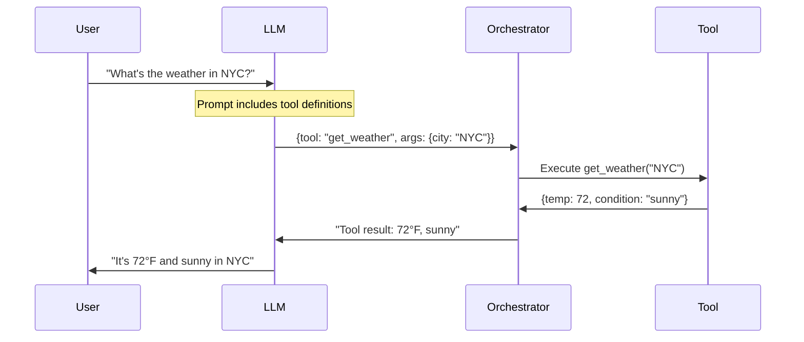

# Tool Calling Pattern

> The foundational pattern for agents - letting LLMs invoke external functions

## When to Use

**Perfect for:**

- Single-turn tasks requiring external data (API calls, database lookups)
- Deterministic operations (calculations, data transformations)
- Extending LLM capabilities with real-time information
- Simple automation (send email, create calendar event)
- Integration with existing APIs and services

**Ideal scenarios:**

- "What's the weather in Seattle?" → Call weather API
- "Calculate 15% tip on $47.83" → Call calculator function
- "Send this email to John" → Call email API
- "Look up customer #12345" → Query database

## When NOT to Use

**❌ Avoid when:**

- **No external data needed** - Direct LLM response is sufficient
- **Multiple dependent steps** - Use sequential chain instead
- **Complex decision trees** - Consider router or ReAct pattern
- **High error rates** - LLM may struggle with tool selection (use simpler routing)
- **Latency critical** - Every tool call adds round-trip delay
- **Cost is primary concern** - Each call costs input + output tokens

**Cost trap:** If users can phrase queries as simple questions, tool calling wastes tokens. Example: "What's 2+2?" shouldn't need a calculator tool.

## Architecture Diagram



## Flow Breakdown

### Step 1: Tool Definition

Define available tools with clear descriptions:

```json
{
  "name": "get_weather",
  "description": "Fetches current weather for a city. Use when user asks about weather conditions.",
  "parameters": {
    "city": {
      "type": "string",
      "description": "City name (e.g., 'Seattle', 'New York')"
    },
    "units": {
      "type": "string",
      "enum": ["fahrenheit", "celsius"],
      "default": "fahrenheit"
    }
  }
}
```

**Critical:** Tool descriptions must be precise - LLM uses them to decide when to invoke.

### Step 2: Prompt Construction

Send prompt with tool definitions:

```
System: You are a helpful assistant. Use tools when needed.

Tools available:
- get_weather(city, units): Get current weather
- calculate(expression): Evaluate math expressions

User: What's the weather in Boston?
```

### Step 3: LLM Response

LLM returns structured tool call:

```json
{
  "tool_call": {
    "name": "get_weather",
    "arguments": {
      "city": "Boston",
      "units": "fahrenheit"
    }
  }
}
```

### Step 4: Tool Execution

Orchestrator executes the tool:

```python
result = tools.get_weather(city="Boston", units="fahrenheit")
# Returns: {"temp": 68, "condition": "cloudy", "humidity": 65}
```

### Step 5: Result Integration

Send result back to LLM:

```
Tool result: {"temp": 68, "condition": "cloudy", "humidity": 65}

Generate final response for user.
```

### Step 6: Final Response

LLM formats user-friendly answer:

```
It's currently 68°F and cloudy in Boston, with 65% humidity.
```

## Tradeoffs Table

| Aspect          | Pro                          | Con                              |
| --------------- | ---------------------------- | -------------------------------- |
| **Latency**     | Single tool call is fast     | Adds 1-3s vs direct LLM response |
| **Cost**        | Only pay for what you use    | 2x token cost (input + output)   |
| **Reliability** | Deterministic tool execution | LLM may choose wrong tool        |
| **Flexibility** | Easy to add new tools        | Each tool increases prompt size  |
| **Debugging**   | Clear execution trace        | Tool errors can confuse LLM      |
| **Scalability** | Stateless, easy to scale     | Rate limits on external APIs     |
| **Accuracy**    | Real-time, factual data      | Dependent on tool quality        |

## Implementation Approaches

### Approach 1: Native Function Calling (OpenAI, Anthropic)

**OpenAI example:**

```python
response = client.chat.completions.create(
    model="gpt-4",
    messages=[{"role": "user", "content": "Weather in NYC?"}],
    tools=[{
        "type": "function",
        "function": {
            "name": "get_weather",
            "description": "Get current weather",
            "parameters": {
                "type": "object",
                "properties": {
                    "city": {"type": "string"}
                },
                "required": ["city"]
            }
        }
    }]
)

# Check if tool call requested
if response.choices[0].message.tool_calls:
    tool_call = response.choices[0].message.tool_calls[0]
    result = execute_tool(tool_call.function.name,
                         json.loads(tool_call.function.arguments))
```

**Pros:** Native support, structured output, well-tested
**Cons:** Vendor lock-in, costs can be higher

---

### Approach 2: ReAct Format (Text-based)

**Prompt structure:**

```
Use this format:
Thought: [your reasoning]
Action: [tool_name]
Action Input: [arguments as JSON]
Observation: [tool result]
... (repeat as needed)
Final Answer: [response to user]

User: What's the weather in Seattle?
```

**LLM output:**

```
Thought: I need to check the weather API
Action: get_weather
Action Input: {"city": "Seattle"}
```

**Pros:** Works with any LLM, full control
**Cons:** Parsing can be fragile, verbose

---

### Approach 3: JSON Mode

**Prompt:**

```
Respond only with valid JSON. If you need to call a tool, use this format:
{"tool": "tool_name", "args": {...}}

User query: Weather in NYC?
```

**Pros:** Structured, model-agnostic
**Cons:** Some models struggle with strict JSON, need validation

## Real-world Example: Customer Data Lookup

**Scenario:** Support agent needs customer information

**Tools available:**

1. `get_customer(customer_id)` - Fetch customer details
2. `get_orders(customer_id)` - Fetch order history
3. `get_support_tickets(customer_id)` - Fetch past tickets

**User query:** "Tell me about customer #12345"

**Execution:**

```
LLM → Tool call: get_customer(12345)
Result: {name: "Jane Doe", email: "jane@example.com", tier: "premium"}

LLM → Response: "Customer Jane Doe (jane@example.com) is a premium tier member."
```

**With follow-up:**

```
User: "Do they have any open orders?"
LLM → Tool call: get_orders(12345)
Result: [{order_id: 789, status: "shipped", date: "2026-01-25"}]

LLM → Response: "Yes, order #789 shipped on January 25th."
```

## Cost Analysis

**Per-request breakdown:**

| Component                  | Token Count      | Cost (@$0.01/1K tokens) |
| -------------------------- | ---------------- | ----------------------- |
| System prompt              | 200 tokens       | $0.002                  |
| Tool definitions (3 tools) | 300 tokens       | $0.003                  |
| User query                 | 50 tokens        | $0.0005                 |
| LLM tool call output       | 100 tokens       | $0.001                  |
| Tool result in context     | 200 tokens       | $0.002                  |
| Final response             | 150 tokens       | $0.0015                 |
| **Total**                  | **1,000 tokens** | **$0.01**               |

**Cost multipliers:**

- Multiple tool calls: Linear increase (2 calls = ~$0.02)
- Large tool results: Can balloon prompt size
- Retries on errors: 2-3x cost if tool fails

**Optimization tips:**

- Cache tool definitions across requests
- Minimize tool result verbosity (summarize before returning to LLM)
- Use cheaper models for tool selection, expensive models for final response

## Common Pitfalls

### 1. Vague Tool Descriptions

**Problem:** LLM doesn't know when to use tool

```json
❌ "description": "Gets data"
✅ "description": "Fetches customer info by ID. Use when user mentions customer number."
```

### 2. Tool Result Overload

**Problem:** Returning massive JSON that bloats context

```python
❌ return database.query("SELECT * FROM customers")  # 10K tokens
✅ return {name: row.name, email: row.email, tier: row.tier}  # 50 tokens
```

### 3. No Error Handling

**Problem:** Tool fails, LLM gets cryptic error

```python
❌ result = api.call()  # Throws exception
✅ try:
    result = api.call()
  except APIError as e:
    result = {"error": "Weather service unavailable", "fallback": "Unable to fetch"}
```

### 4. Hallucinated Tool Names

**Problem:** LLM invents non-existent tools
**Solution:** Use strict parsing; reject unknown tool names

### 5. Missing Required Parameters

**Problem:** LLM calls tool without all required args
**Solution:** Validate before execution; return clear error to retry

### 6. Ignoring Rate Limits

**Problem:** Tool calls overwhelm external API
**Solution:** Implement rate limiting, caching, circuit breakers

### 7. Tool Overload (Too Many Tools)

**Problem:** Providing 20+ tools confuses LLM
**Solution:**

- Limit to 5-10 tools per context
- Use router pattern to group specialized tools
- Dynamic tool loading based on context

## Advanced Patterns

### Parallel Tool Calling

Some APIs support multiple tool calls in one LLM response:

```json
{
  "tool_calls": [
    { "name": "get_weather", "args": { "city": "NYC" } },
    { "name": "get_weather", "args": { "city": "LA" } },
    { "name": "get_weather", "args": { "city": "Chicago" } }
  ]
}
```

Execute in parallel for speed.

### Tool Chaining

Sequential tool calls without returning to user:

```
User: "Email John the weather report"
→ Tool 1: get_weather("NYC")
→ Tool 2: send_email(to="john@example.com", body=weather_result)
→ Response: "Weather report sent to John"
```

### Conditional Tool Calling

LLM decides if tool is needed:

```
User: "What's 2+2?"
LLM: [No tool call, direct response] "4"

User: "What's the 15th root of 2047?"
LLM: [Tool call] calculate("2047**(1/15)")
```

## Testing & Validation

### Test Cases

1. **Happy path:** Tool called correctly, valid result
2. **Wrong tool:** LLM picks incorrect tool
3. **Missing args:** LLM omits required parameter
4. **Tool failure:** External API returns error
5. **Hallucinated tool:** LLM invents non-existent tool
6. **No tool needed:** Direct answer without tool

### Validation Checklist

- ✅ Schema validation (JSON structure correct?)
- ✅ Tool exists in registry
- ✅ All required parameters provided
- ✅ Parameter types match schema
- ✅ Tool execution succeeds
- ✅ Result is within expected format

## Production Considerations

### Observability

Log every tool call:

```python
{
  "timestamp": "2026-01-27T10:30:00Z",
  "tool": "get_weather",
  "args": {"city": "NYC"},
  "result": {"temp": 72, "condition": "sunny"},
  "duration_ms": 245,
  "success": true
}
```

### Caching

Cache tool results for identical calls:

```python
cache_key = f"{tool_name}:{json.dumps(args)}"
if cache.get(cache_key):
    return cache.get(cache_key)
```

### Security

- **Input validation:** Sanitize all tool arguments
- **Permission checks:** Verify user can call tool
- **Rate limiting:** Prevent abuse
- **Audit logs:** Track who called what

### Retries

Implement exponential backoff for transient failures:

```python
@retry(max_attempts=3, backoff=2)
def execute_tool(name, args):
    return tools[name](**args)
```

## References

- **OpenAI Function Calling:** [API Docs](https://platform.openai.com/docs/guides/function-calling)
- **Anthropic Tool Use:** [Claude Tools](https://docs.anthropic.com/claude/docs/tool-use)
- **ReAct Paper:** [arXiv:2210.03629](https://arxiv.org/abs/2210.03629)
- **Gorilla LLM (Tool Use):** [Project Page](https://gorilla.cs.berkeley.edu/)

## Next Steps

- **Multiple dependent steps?** → See [Sequential Chain](./sequential-chain.md)
- **Need reasoning loops?** → See [ReAct Pattern](./react-reasoning-acting.md)
- **Multiple tool domains?** → See [Router Agent](./router-agent.md)
- **Production deployment?** → See [Error Handling](../production/error-handling.md)
