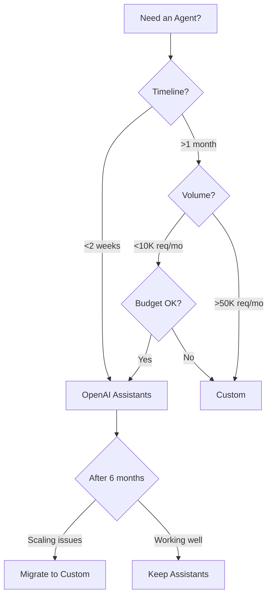

# OpenAI Assistants API vs Custom Agents

> Managed service vs self-hosted: the ultimate tradeoff

> ⚠️ **DEPRECATION NOTICE (Updated Jan 2026)**
> OpenAI announced that the Assistants API will be sunset in **July 2026**. While this comparison remains valuable for understanding managed vs. self-hosted tradeoffs, **do not build new production systems on Assistants API**.
>
> **For new projects:**
>
> - Use custom agents with OpenAI's Chat Completions API
> - Consider [LangGraph](https://langchain-ai.github.io/langgraph/) for stateful workflows
> - See [Framework Comparisons](./langchain-vs-llamaindex-vs-custom.md) for alternatives
>
> This document is maintained for:
>
> - Teams migrating away from Assistants API
> - Understanding historical managed service approaches
> - Learning managed vs. self-hosted architectural tradeoffs

## TL;DR

| **Factor**             | **OpenAI Assistants**         | **Custom Agents** |
| ---------------------- | ----------------------------- | ----------------- |
| **Time to Production** | Days                          | Weeks             |
| **Status**             | 🚫 **DEPRECATED (July 2026)** | ✅ Recommended    |
| **Control**            | Low                           | High              |
| **Cost (10K req/mo)**  | $200-400                      | $150-250          |
| **Vendor Lock-in**     | High                          | None              |
| **Debugging**          | Limited                       | Full              |
| **Customization**      | Constrained                   | Unlimited         |
| **Maintenance**        | None                          | High              |

**Choose OpenAI Assistants for:** Rapid MVP, standard use cases, small teams
**Choose Custom for:** Production scale, unique requirements, multi-model needs

---

## Feature Matrix

| **Feature**           | **OpenAI Assistants**                           | **Custom Agents**     |
| --------------------- | ----------------------------------------------- | --------------------- |
| **Setup Time**        | 10 minutes                                      | Days to weeks         |
| **Built-in Tools**    | Code Interpreter, File Search, Function Calling | Build yourself        |
| **Memory Management** | Automatic (threads)                             | Manual implementation |
| **Model Choice**      | OpenAI only                                     | Any provider          |
| **State Management**  | Managed                                         | Roll your own         |
| **File Handling**     | Built-in (up to 2GB)                            | Custom storage        |
| **Streaming**         | Limited                                         | Full control          |
| **Observability**     | Basic                                           | Custom tooling        |
| **Cost Transparency** | Opaque (token multipliers)                      | Full visibility       |
| **Rate Limits**       | Shared tier limits                              | Your infrastructure   |
| **Data Privacy**      | OpenAI servers                                  | Your control          |
| **Custom Logic**      | Function calling only                           | Unlimited             |

---

## OpenAI Assistants API

### How It Works

```python
from openai import OpenAI

client = OpenAI()

# 1. Create assistant
assistant = client.beta.assistants.create(
    name="Math Tutor",
    instructions="You are a math tutor. Use code interpreter for calculations.",
    tools=[{"type": "code_interpreter"}],
    model="gpt-4-turbo"
)

# 2. Create thread (conversation)
thread = client.beta.threads.create()

# 3. Add message
message = client.beta.threads.messages.create(
    thread_id=thread.id,
    role="user",
    content="Solve: x^2 + 5x + 6 = 0"
)

# 4. Run assistant
run = client.beta.threads.runs.create(
    thread_id=thread.id,
    assistant_id=assistant.id
)

# 5. Wait for completion
while run.status != "completed":
    run = client.beta.threads.runs.retrieve(
        thread_id=thread.id,
        run_id=run.id
    )
    time.sleep(1)

# 6. Get response
messages = client.beta.threads.messages.list(thread_id=thread.id)
print(messages.data[0].content[0].text.value)
```

### Built-in Capabilities

**1. Code Interpreter**

```python
# Automatic Python execution sandbox
assistant = client.beta.assistants.create(
    tools=[{"type": "code_interpreter"}],
    model="gpt-4"
)

# Can generate charts, analyze data, run simulations
# No setup required
```

**2. File Search (RAG)**

```python
# Built-in vector search
assistant = client.beta.assistants.create(
    tools=[{"type": "file_search"}],
    model="gpt-4"
)

# Upload files
vector_store = client.beta.vector_stores.create(name="Product Docs")
file = client.files.create(file=open("docs.pdf", "rb"), purpose="assistants")
client.beta.vector_stores.files.create(vector_store_id=vector_store.id, file_id=file.id)

# Automatic chunking, embedding, retrieval
```

**3. Function Calling**

```python
# Custom tools
tools = [{
    "type": "function",
    "function": {
        "name": "get_weather",
        "description": "Get weather for a location",
        "parameters": {
            "type": "object",
            "properties": {
                "location": {"type": "string"}
            }
        }
    }
}]

assistant = client.beta.assistants.create(tools=tools, model="gpt-4")
```

### Strengths

✅ **Zero Infrastructure**

- No servers to manage
- Automatic scaling
- Built-in state management

✅ **Rapid Development**

- Working agent in <1 hour
- No boilerplate code
- Batteries included

✅ **Managed Memory**

- Automatic conversation threads
- Built-in context window management
- No memory architecture decisions

### Weaknesses

❌ **Hidden Costs**

```python
# Unclear pricing
# - Code interpreter runs: unknown token multiplier
# - File search: $0.10/GB/day + retrieval costs
# - You only see final bill
```

❌ **Vendor Lock-in**

- OpenAI models only
- Can't switch to Anthropic, Llama, etc.
- API changes at their discretion

❌ **Limited Debugging**

```python
# You can't see:
# - Internal prompts
# - Exact token usage per step
# - Why file search returned specific chunks
# - Code interpreter's actual code
```

❌ **Constrained Customization**

```python
# Can't customize:
# - Retrieval algorithm
# - Code execution environment
# - Prompt templates (only instructions)
# - Retry logic
# - Token limits per step
```

### When to Choose OpenAI Assistants

✅ **Use Assistants API if:**

- MVP or prototype (ship in days)
- Standard use cases (chat, RAG, code execution)
- Small team without DevOps
- OpenAI models meet your needs
- Cost transparency isn't critical
- Not handling sensitive data

❌ **Avoid Assistants API if:**

- Need multi-model support
- Cost optimization is critical
- Require full observability
- Custom memory strategies needed
- Data must stay on your infrastructure
- High-volume production (>100K req/mo)

---

## Custom Agents

### Architecture

```python
class CustomAgent:
    def __init__(self, llm, tools, memory):
        self.llm = llm  # Any provider
        self.tools = tools
        self.memory = memory  # Your implementation

    async def run(self, query):
        # You control everything
        context = self.memory.retrieve(query)

        messages = self.build_messages(query, context)

        response = await self.llm.generate(
            messages=messages,
            functions=self.tools,
            temperature=0.7
        )

        if response.function_call:
            result = await self.execute_tool(response.function_call)
            self.memory.store(query, result)
            return await self.run(f"Tool result: {result}")

        return response.content
```

### Strengths

✅ **Full Control**

```python
# Choose any model
from anthropic import Anthropic
from openai import OpenAI

llm = Anthropic()  # or OpenAI(), or Cohere(), or local model

# Custom retrieval
def custom_rag(query):
    # Your algorithm
    results = pinecone.query(
        vector=embed(query),
        top_k=5,
        filter={"category": "technical"}  # Custom filters
    )
    return results
```

✅ **Cost Transparency**

```python
# Track every token
with token_counter:
    response = llm.generate(messages)

print(f"Prompt tokens: {token_counter.prompt_tokens}")
print(f"Completion tokens: {token_counter.completion_tokens}")
print(f"Cost: ${token_counter.cost}")
```

✅ **Multi-Model Support**

```python
# Route by task
def smart_routing(query):
    if is_simple(query):
        return gpt_3_5_turbo(query)  # Cheap
    elif needs_reasoning(query):
        return claude_opus(query)  # Best reasoning
    else:
        return gpt_4_turbo(query)  # Balanced
```

✅ **Full Observability**

```python
# See everything
logger.info(f"Query: {query}")
logger.info(f"Context retrieved: {context}")
logger.info(f"Prompt: {prompt}")
logger.info(f"Response: {response}")
logger.info(f"Tokens: {tokens}, Cost: ${cost}")
```

### Weaknesses

❌ **Development Time**

- Build memory system
- Implement retry logic
- Set up observability
- Handle edge cases
- 2-4 weeks minimum

❌ **Infrastructure**

```python
# You manage:
- Vector database (Pinecone, Weaviate)
- API gateways
- Rate limiting
- Caching layers
- Monitoring stack
```

❌ **Maintenance Burden**

```python
# Ongoing work:
- Update to new API versions
- Monitor for failures
- Optimize performance
- Handle security patches
```

### When to Choose Custom

✅ **Build Custom if:**

- Production scale (>50K req/mo)
- Need multi-model support
- Cost optimization critical (can save 40-60%)
- Unique architecture requirements
- Data privacy regulations
- Team has engineering capacity

❌ **Avoid Custom if:**

- Need to ship in <2 weeks
- Small team (1-2 people)
- Standard use cases work
- Cost isn't primary concern
- Prefer managed services

---

## Cost Comparison

**Scenario:** 10,000 requests/month, average 2K prompt tokens, 500 completion tokens

### OpenAI Assistants

```
Base cost (GPT-4 Turbo):
- Prompt: 2K tokens × $0.01/1K = $0.02
- Completion: 500 tokens × $0.03/1K = $0.015
- Per request: $0.035
- 10K requests: $350

Hidden multipliers:
- Code Interpreter: ~2x tokens (runs, errors, retries)
- File Search: $0.10/GB/day + retrieval overhead
- State management: Storage fees

Estimated total: $400-600/month
```

### Custom Agent

```
LLM cost (GPT-4 Turbo):
- Same: $350

Infrastructure:
- Vector DB: $50/mo (Pinecone Starter)
- Hosting: $30/mo (server)
- Monitoring: $20/mo (DataDog)

Optimization savings:
- Caching: -30% ($105 saved)
- Model routing: -20% ($70 saved)

Total: $350 - $175 + $100 = $275/month
```

**Savings:** $125-325/month
**Break-even:** After ~4-6 months (accounting for dev time)

---

## Migration Path: Assistants → Custom

### Phase 1: Parallel Run

```python
# Run both simultaneously
def dual_mode_agent(query):
    # Production (Assistants)
    prod_result = assistants_api(query)

    # Shadow (Custom)
    custom_result = custom_agent(query)

    # Compare & log differences
    compare_results(prod_result, custom_result)

    return prod_result  # Still using Assistants
```

### Phase 2: Gradual Migration

```python
# Route by confidence
def hybrid_agent(query):
    if is_well_tested(query):
        return custom_agent(query)  # Migrated
    else:
        return assistants_api(query)  # Fallback
```

### Phase 3: Full Custom

```python
# Complete migration
def production_agent(query):
    return custom_agent(query)
```

---

## Decision Framework



### Quick Rules

**Start with Assistants if:**

1. MVP stage
2. Team <5 people
3. Volume <20K req/mo
4. OpenAI models sufficient

**Build Custom if:**

1. > 50K req/mo
2. Need Anthropic/other models
3. Cost optimization critical
4. Data privacy requirements

**Migrate Assistants → Custom when:**

1. Monthly costs >$500
2. Need better observability
3. Hit Assistants API limits
4. Require custom logic

---

## Real-World Examples

### Startup: MVP Phase

**Choice:** OpenAI Assistants
**Why:** Shipped in 3 days, validated idea
**Cost:** $200/mo
**Result:** ✅ Fast validation, deferred complexity

### Scale-up: 100K req/mo

**Choice:** Migrated to Custom
**Why:** $3K/mo → $1.2K/mo (60% savings)
**Result:** ✅ ROI positive in 4 months

### Enterprise: Compliance

**Choice:** Custom from start
**Why:** Data must stay on-prem
**Result:** ✅ Meets regulations, full control

---

## Common Pitfalls

### 1. Premature Custom Build

**Problem:** Building custom for 100 req/mo
**Solution:** Start with Assistants, migrate at scale

### 2. Ignoring Hidden Costs

**Problem:** Assistants bill shock ($600 vs expected $300)
**Solution:** Monitor usage closely, set budgets

### 3. Vendor Lock-in

**Problem:** Can't migrate off Assistants easily
**Solution:** Abstract API layer from start

### 4. Over-Engineering Custom

**Problem:** 3-month build for simple agent
**Solution:** Start simple, iterate

---

## References

- **OpenAI Assistants:** [API Documentation](https://platform.openai.com/docs/assistants)
- **Custom Agent Patterns:** [OpenAI Cookbook](https://cookbook.openai.com/)

---

## Next Steps

- **Framework comparison?** → See [LangChain vs Custom](./langchain-vs-llamaindex-vs-custom.md)
- **Execution models?** → See [Sync vs Async](./synchronous-vs-asynchronous.md)
- **Real implementations?** → See [Case Studies](../04-case-studies/)
