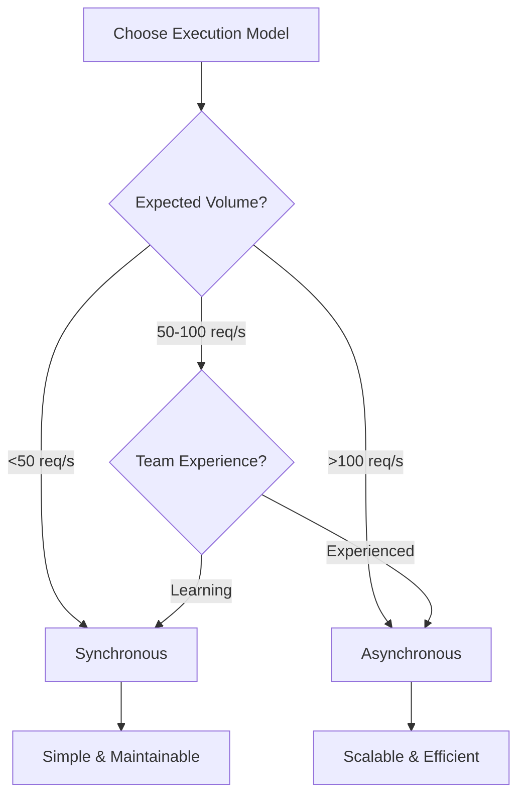

# Synchronous vs Asynchronous Agent Execution

> Performance tradeoffs: blocking vs concurrent execution

## TL;DR

| **Factor**           | **Synchronous**      | **Asynchronous**             |
| -------------------- | -------------------- | ---------------------------- |
| **Complexity**       | Low                  | High                         |
| **Throughput**       | 5-20 req/s           | 50-500 req/s                 |
| **Latency**          | Same as async        | Same as sync                 |
| **Resource Usage**   | 1 request = 1 thread | 1000s requests = few threads |
| **Debugging**        | Easy                 | Moderate                     |
| **Code Readability** | High                 | Lower                        |
| **Use Case**         | CLI tools, scripts   | Web APIs, high-volume        |

**Choose Sync for:** Simple scripts, low volume, rapid development
**Choose Async for:** Production APIs, >50 req/s, I/O-bound workloads

---

## The Fundamental Difference

### Synchronous (Blocking)

```python
def sync_agent(query):
    # Each line blocks until complete
    context = retrieve_context(query)  # Wait 200ms
    response = llm_call(query, context)  # Wait 2s
    result = process_response(response)  # Wait 50ms
    return result

# Handles 1 request at a time
result1 = sync_agent("query 1")  # 2.25s
result2 = sync_agent("query 2")  # 2.25s
# Total: 4.5s for 2 requests
```

### Asynchronous (Non-blocking)

```python
async def async_agent(query):
    # Yields control while waiting
    context = await retrieve_context(query)  # Yields during I/O
    response = await llm_call(query, context)  # Yields during network
    result = await process_response(response)
    return result

# Handles multiple requests concurrently
results = await asyncio.gather(
    async_agent("query 1"),  # 2.25s
    async_agent("query 2")   # 2.25s (overlaps!)
)
# Total: ~2.25s for 2 requests (not 4.5s!)
```

---

## Performance Comparison

### Throughput

| **Requests/Second** | **Synchronous** | **Asynchronous** | **Speedup** |
| ------------------- | --------------- | ---------------- | ----------- |
| Single request      | 1 req/s         | 1 req/s          | 1x          |
| 10 concurrent       | 2 req/s         | 20 req/s         | 10x         |
| 100 concurrent      | 2 req/s         | 80 req/s         | 40x         |
| 1000 concurrent     | 2 req/s         | 200 req/s        | 100x        |

_Assumes 500ms per request, I/O-bound workload_

### Resource Usage

```python
# Synchronous: 1 thread per request
# 100 requests = 100 threads
# Memory: ~100MB (1MB/thread)

# Asynchronous: Few threads, many coroutines
# 1000 requests = 4 threads + 1000 lightweight coroutines
# Memory: ~10MB (10KB/coroutine)
```

### Latency (P50/P95)

| **Metric**           | **Synchronous** | **Asynchronous** |
| -------------------- | --------------- | ---------------- |
| Single request (P50) | 2.0s            | 2.0s             |
| Under load (P50)     | 2.0s            | 2.1s             |
| Under load (P95)     | 3.5s            | 2.8s             |

_Async has lower P95 due to better queueing_

---

## Synchronous Implementation

### Simple Agent

```python
import openai

def sync_agent(query, tools):
    """Blocking agent execution"""

    messages = [
        {"role": "system", "content": "You are a helpful assistant"},
        {"role": "user", "content": query}
    ]

    # Blocks until response
    response = openai.ChatCompletion.create(
        model="gpt-4",
        messages=messages,
        functions=tools
    )

    if response.choices[0].message.get("function_call"):
        tool_result = execute_tool(response.choices[0].message.function_call)

        messages.append(response.choices[0].message)
        messages.append({
            "role": "function",
            "name": response.choices[0].message.function_call.name,
            "content": str(tool_result)
        })

        # Blocking recursive call
        return sync_agent(query, tools)

    return response.choices[0].message.content
```

### Parallel Execution (Threading)

```python
from concurrent.futures import ThreadPoolExecutor

def sync_parallel_agent(queries):
    """Run multiple sync agents in parallel"""

    with ThreadPoolExecutor(max_workers=10) as executor:
        results = list(executor.map(sync_agent, queries))

    return results

# Usage
results = sync_parallel_agent([
    "What's the weather?",
    "Calculate 2+2",
    "Summarize this doc"
])
```

### Pros

✅ **Simple Code**

```python
# Linear flow, easy to read
result = step1()
result = step2(result)
return step3(result)
```

✅ **Easy Debugging**

```python
# Stack traces are straightforward
# Debugger works naturally
# No event loop complexity
```

✅ **Compatibility**

```python
# Works with all libraries
# No async/await syntax
# Easier for beginners
```

### Cons

❌ **Low Throughput**

```python
# 1 request = 1 blocked thread
# 100 concurrent requests = 100 threads
# High memory usage
```

❌ **Poor Scaling**

```python
# Can't handle >100 req/s efficiently
# Thread overhead increases
```

---

## Asynchronous Implementation

### Basic Async Agent

```python
import asyncio
import openai

async def async_agent(query, tools):
    """Non-blocking agent execution"""

    messages = [
        {"role": "system", "content": "You are a helpful assistant"},
        {"role": "user", "content": query}
    ]

    # Yields control during I/O
    response = await openai.ChatCompletion.acreate(
        model="gpt-4",
        messages=messages,
        functions=tools
    )

    if response.choices[0].message.get("function_call"):
        # Non-blocking tool execution
        tool_result = await execute_tool_async(
            response.choices[0].message.function_call
        )

        messages.append(response.choices[0].message)
        messages.append({
            "role": "function",
            "name": response.choices[0].message.function_call.name,
            "content": str(tool_result)
        })

        # Non-blocking recursion
        return await async_agent(query, tools)

    return response.choices[0].message.content
```

### Concurrent Execution

```python
async def process_multiple_queries(queries):
    """Process many queries concurrently"""

    # All run concurrently
    tasks = [async_agent(query, tools) for query in queries]

    # Wait for all to complete
    results = await asyncio.gather(*tasks)

    return results

# Usage
queries = ["query1", "query2", "query3", ...]
results = asyncio.run(process_multiple_queries(queries))
```

### Advanced: Rate Limiting

```python
class AsyncAgentWithRateLimit:
    def __init__(self, max_concurrent=10):
        self.semaphore = asyncio.Semaphore(max_concurrent)

    async def run(self, query):
        """Limit concurrent executions"""

        async with self.semaphore:
            return await async_agent(query, tools)

# Only 10 agents run at once
agent = AsyncAgentWithRateLimit(max_concurrent=10)

tasks = [agent.run(query) for query in queries]
results = await asyncio.gather(*tasks)
```

### Pros

✅ **High Throughput**

```python
# Handle 1000s of concurrent requests
# Minimal memory overhead
# Efficient I/O multiplexing
```

✅ **Better Resource Usage**

```python
# 1000 requests = 4 threads + coroutines
# Low memory footprint
# CPU efficient
```

✅ **Ideal for I/O-Bound**

```python
# LLM API calls: 90% waiting
# Database queries: 80% waiting
# Perfect for async
```

### Cons

❌ **Complexity**

```python
# async/await everywhere
# Event loop management
# Harder to learn
```

❌ **Debugging Challenges**

```python
# Stack traces are confusing
# Harder to step through
# More moving parts
```

❌ **Library Compatibility**

```python
# Not all libraries support async
# May need wrappers or thread pools
```

---

## When to Use Each

### Use Synchronous If:

✅ **Low Volume**

- <50 requests/second
- CLI tools
- Background scripts

✅ **Simple Requirements**

```python
# One-off tasks
# Batch processing
# Internal tools
```

✅ **Team Constraints**

```python
# Junior developers
# Rapid prototyping
# Short-term projects
```

### Use Asynchronous If:

✅ **High Volume**

- > 100 requests/second
- Production web APIs
- Real-time systems

✅ **I/O-Bound Workloads**

```python
# Many LLM API calls
# Database queries
# Network requests
```

✅ **Resource Efficiency Matters**

```python
# Cloud hosting costs
# Memory constraints
# Scaling requirements
```

---

## Hybrid Approach

### Sync API with Async Backend

```python
from fastapi import FastAPI
import asyncio

app = FastAPI()

# Async backend
async def async_agent(query):
    return await llm_call(query)

# Sync endpoint (FastAPI handles conversion)
@app.post("/agent")
async def agent_endpoint(query: str):
    # Runs async internally
    result = await async_agent(query)
    return {"result": result}

# FastAPI automatically handles:
# - Async execution
# - Concurrent requests
# - Event loop management
```

### Thread Pool for Blocking Libraries

```python
import asyncio
from concurrent.futures import ThreadPoolExecutor

executor = ThreadPoolExecutor(max_workers=4)

async def run_blocking_in_thread(func, *args):
    """Run blocking code in thread pool"""

    loop = asyncio.get_event_loop()
    result = await loop.run_in_executor(executor, func, *args)
    return result

# Usage
async def async_agent_with_blocking_lib():
    # Library doesn't support async
    result = await run_blocking_in_thread(blocking_library_call, args)
    return result
```

---

## Performance Optimization

### Synchronous Optimization

```python
# 1. Connection pooling
from requests.adapters import HTTPAdapter
from urllib3.util.retry import Retry

session = requests.Session()
adapter = HTTPAdapter(pool_connections=100, pool_maxsize=100)
session.mount('https://', adapter)

# 2. Batch requests
def batch_sync_requests(queries, batch_size=10):
    results = []
    for i in range(0, len(queries), batch_size):
        batch = queries[i:i+batch_size]
        with ThreadPoolExecutor(max_workers=batch_size) as executor:
            batch_results = list(executor.map(sync_agent, batch))
        results.extend(batch_results)
    return results
```

### Asynchronous Optimization

```python
# 1. Connection pooling (automatic with aiohttp)
import aiohttp

async with aiohttp.ClientSession() as session:
    tasks = [make_request(session, url) for url in urls]
    results = await asyncio.gather(*tasks)

# 2. Limit concurrency
async def limited_gather(tasks, limit=50):
    """Process tasks with concurrency limit"""

    semaphore = asyncio.Semaphore(limit)

    async def limited_task(task):
        async with semaphore:
            return await task

    return await asyncio.gather(*[limited_task(t) for t in tasks])

# 3. Timeout management
async def agent_with_timeout(query, timeout=10):
    try:
        return await asyncio.wait_for(async_agent(query), timeout=timeout)
    except asyncio.TimeoutError:
        return {"error": "Request timeout"}
```

---

## Real-World Benchmarks

### Test Setup

- 1000 requests
- GPT-4 Turbo (avg 2s latency)
- 4-core server

### Results

| **Implementation**        | **Total Time** | **Req/s** | **Memory** |
| ------------------------- | -------------- | --------- | ---------- |
| Synchronous (serial)      | 2000s          | 0.5       | 50MB       |
| Synchronous (10 threads)  | 200s           | 5         | 150MB      |
| Synchronous (100 threads) | 20s            | 50        | 800MB      |
| Asynchronous (unlimited)  | 8s             | 125       | 100MB      |
| Asynchronous (50 limit)   | 10s            | 100       | 80MB       |

**Winner:** Async with concurrency limit (best speed + memory)

---

## Migration Guide

### Sync → Async

```python
# Step 1: Identify I/O operations
def sync_agent(query):
    context = db.query(query)  # I/O
    response = llm.generate(query)  # I/O
    return response

# Step 2: Convert to async
async def async_agent(query):
    context = await db.query_async(query)  # Non-blocking
    response = await llm.generate_async(query)  # Non-blocking
    return response

# Step 3: Use async libraries
# - aiohttp instead of requests
# - asyncpg instead of psycopg2
# - motor instead of pymongo
```

### Async → Sync (rare)

```python
# Wrap async function
def sync_wrapper(query):
    return asyncio.run(async_agent(query))

# Use in sync context
result = sync_wrapper("query")
```

---

## Common Pitfalls

### 1. Blocking the Event Loop

```python
# ❌ Bad: Blocks all async tasks
async def bad_agent(query):
    time.sleep(2)  # Blocks event loop!
    return result

# ✅ Good: Non-blocking sleep
async def good_agent(query):
    await asyncio.sleep(2)  # Yields control
    return result
```

### 2. Not Using Connection Pools

```python
# ❌ Bad: New connection per request
async def bad():
    async with aiohttp.ClientSession() as session:
        return await session.get(url)

# ✅ Good: Reuse session
session = aiohttp.ClientSession()

async def good():
    return await session.get(url)
```

### 3. Uncontrolled Concurrency

```python
# ❌ Bad: Can overwhelm system
tasks = [async_agent(q) for q in queries]  # 10,000 tasks!
results = await asyncio.gather(*tasks)

# ✅ Good: Limit concurrency
semaphore = asyncio.Semaphore(50)
async def limited(q):
    async with semaphore:
        return await async_agent(q)

results = await asyncio.gather(*[limited(q) for q in queries])
```

---

## Decision Framework



---

## References

- **Python Asyncio:** [Official Docs](https://docs.python.org/3/library/asyncio.html)
- **FastAPI:** [Async Guide](https://fastapi.tiangolo.com/async/)
- **Real Python:** [Async Tutorial](https://realpython.com/async-io-python/)

---

## Next Steps

- **Need framework guidance?** → See [LangChain vs Custom](./langchain-vs-llamaindex-vs-custom.md)
- **Real implementations?** → See [Case Studies](../04-case-studies/)
