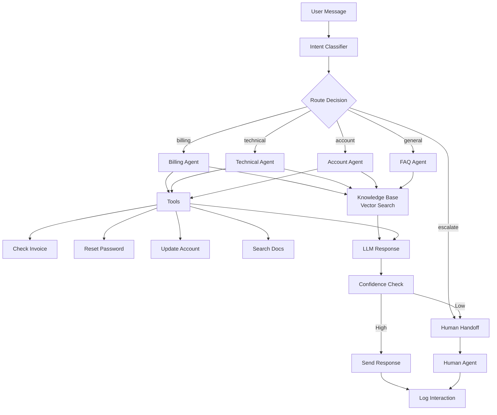

# Case Study: Customer Support Agent

> Building a production-ready support agent that reduced response time by 80%

## Problem Statement

**Company:** SaaS company with 10K users
**Challenge:** Support team overwhelmed with 500+ tickets/day
**Goal:** Automate Tier 1 support (password resets, billing questions, basic troubleshooting)

### Pain Points Before Agent

- **Response time:** 4-6 hours average
- **Support cost:** $30K/month (3 full-time agents)
- **Repetitive questions:** 60% were FAQ-level
- **Handoff issues:** Information lost between agents
- **24/7 coverage:** Impossible with small team

### Success Metrics

- Reduce response time to <5 minutes
- Handle 70%+ of Tier 1 tickets autonomously
- Maintain >90% customer satisfaction
- Reduce support costs by 40%

---

## Pattern Selection

### Why Router Agent + Hierarchical Pattern?

**Decision process:**

1. **Not Tool Calling alone:** Need to route to specialized handlers
2. **Not Sequential Chain:** Questions vary too much
3. **✅ Router Agent:** Classify intent, route to specialist
4. **✅ Hierarchical:** Manager routes, specialists handle specific domains

### Architecture Choice

```
User Query
    ↓
Router Agent (Manager)
    ↓
    ├─→ Billing Agent
    ├─→ Technical Support Agent
    ├─→ Account Management Agent
    └─→ General FAQ Agent
```

---

## Architecture Diagram



---

## Implementation Details

### 1. Intent Classification (Router)

```python
class SupportRouter:
    def __init__(self, llm):
        self.llm = llm
        self.confidence_threshold = 0.8

    async def classify_intent(self, query):
        """Route query to appropriate specialist"""

        prompt = f"""Classify this support query into one category:

Categories:
- billing: Payment, invoices, refunds, pricing
- technical: Errors, bugs, integrations, API issues
- account: Login, password, profile, settings
- general: FAQ, how-to, product questions
- escalate: Complex issues requiring human

Query: {query}

Return JSON: {{"category": "...", "confidence": 0.0-1.0}}
"""

        response = await self.llm.generate(prompt)
        result = json.loads(response)

        if result["confidence"] < self.confidence_threshold:
            return {"category": "escalate", "reason": "low_confidence"}

        return result

    async def route(self, query):
        """Route to specialist agent"""

        intent = await self.classify_intent(query)

        if intent["category"] == "billing":
            return await self.billing_agent.handle(query)
        elif intent["category"] == "technical":
            return await self.technical_agent.handle(query)
        elif intent["category"] == "account":
            return await self.account_agent.handle(query)
        elif intent["category"] == "general":
            return await self.faq_agent.handle(query)
        else:
            return await self.escalate_to_human(query, intent.get("reason"))
```

### 2. Specialist Agent (Billing Example)

```python
class BillingAgent:
    def __init__(self, llm, knowledge_base, tools):
        self.llm = llm
        self.kb = knowledge_base
        self.tools = {
            "get_invoice": self.get_invoice,
            "process_refund": self.process_refund,
            "update_payment": self.update_payment
        }

    async def handle(self, query):
        """Handle billing queries with RAG + tools"""

        # 1. Retrieve relevant context
        context = await self.kb.search(query, category="billing")

        # 2. Determine if tools needed
        response = await self.llm.generate(
            messages=self.build_messages(query, context),
            functions=self.get_function_schemas(),
            temperature=0
        )

        # 3. Execute tools if requested
        if response.function_call:
            tool_result = await self.execute_tool(response.function_call)

            # 4. Generate final response with tool results
            final_response = await self.llm.generate(
                messages=self.build_messages(query, context, tool_result),
                temperature=0.3
            )

            return {
                "answer": final_response,
                "tools_used": [response.function_call.name],
                "confidence": "high"
            }

        return {
            "answer": response.content,
            "tools_used": [],
            "confidence": self.calculate_confidence(response)
        }

    async def get_invoice(self, user_id, invoice_id=None):
        """Fetch user invoices"""
        # Integration with billing system
        invoices = await billing_api.get_invoices(user_id)
        return invoices

    async def process_refund(self, invoice_id, amount, reason):
        """Process refund request"""
        # Requires approval for >$100
        if amount > 100:
            return {"status": "pending_approval", "ticket_created": True}

        result = await billing_api.refund(invoice_id, amount)
        return {"status": "refunded", "amount": amount}
```

### 3. Knowledge Base (RAG)

```python
class SupportKnowledgeBase:
    def __init__(self, vector_store):
        self.vector_store = vector_store

    async def search(self, query, category=None, top_k=5):
        """Retrieve relevant support docs"""

        # Embed query
        query_embedding = await self.embed(query)

        # Search with filters
        filters = {"category": category} if category else {}

        results = await self.vector_store.query(
            vector=query_embedding,
            top_k=top_k,
            filter=filters,
            include_metadata=True
        )

        # Format context
        context = "\n\n".join([
            f"[{r.metadata['title']}]\n{r.metadata['content']}"
            for r in results.matches
        ])

        return context

    async def embed(self, text):
        """Generate embeddings"""
        response = await openai.Embedding.acreate(
            input=text,
            model="text-embedding-3-small"
        )
        return response.data[0].embedding
```

### 4. Escalation Logic

```python
class EscalationHandler:
    def __init__(self, confidence_threshold=0.7):
        self.threshold = confidence_threshold

    async def should_escalate(self, query, agent_response):
        """Determine if human intervention needed"""

        reasons_to_escalate = []

        # 1. Low confidence
        if agent_response["confidence"] < self.threshold:
            reasons_to_escalate.append("low_confidence")

        # 2. Sentiment analysis
        sentiment = await self.analyze_sentiment(query)
        if sentiment["score"] < -0.5:  # Very negative
            reasons_to_escalate.append("negative_sentiment")

        # 3. Complexity detection
        if self.is_complex(query):
            reasons_to_escalate.append("complex_query")

        # 4. Explicit request
        if any(word in query.lower() for word in ["human", "agent", "representative"]):
            reasons_to_escalate.append("human_requested")

        return len(reasons_to_escalate) > 0, reasons_to_escalate

    def is_complex(self, query):
        """Check for complexity indicators"""
        indicators = [
            len(query.split()) > 100,  # Long query
            query.count("?") > 3,  # Multiple questions
            "legal" in query.lower(),
            "lawsuit" in query.lower()
        ]
        return any(indicators)

    async def create_ticket(self, query, context, reasons):
        """Create support ticket for human agent"""

        ticket = {
            "query": query,
            "context": context,
            "escalation_reasons": reasons,
            "priority": self.calculate_priority(reasons),
            "created_at": datetime.now()
        }

        # Send to ticketing system
        ticket_id = await ticketing_api.create(ticket)

        # Notify human agent
        await self.notify_agent(ticket_id, ticket["priority"])

        return ticket_id
```

---

## Memory Strategy

### Conversation Memory

```python
class ConversationMemory:
    def __init__(self, redis_client):
        self.redis = redis_client
        self.ttl = 3600  # 1 hour session

    async def store_message(self, user_id, message, role):
        """Store conversation turn"""

        key = f"conversation:{user_id}"

        # Append to conversation history
        await self.redis.rpush(key, json.dumps({
            "role": role,
            "content": message,
            "timestamp": datetime.now().isoformat()
        }))

        # Set expiration
        await self.redis.expire(key, self.ttl)

    async def get_history(self, user_id, max_turns=10):
        """Retrieve recent conversation"""

        key = f"conversation:{user_id}"

        # Get last N messages
        messages = await self.redis.lrange(key, -max_turns, -1)

        return [json.loads(m) for m in messages]

    async def clear_history(self, user_id):
        """Clear conversation after resolution"""
        await self.redis.delete(f"conversation:{user_id}")
```

### User Context

```python
class UserContext:
    def __init__(self, db):
        self.db = db

    async def get_context(self, user_id):
        """Fetch relevant user information"""

        user = await self.db.users.find_one({"id": user_id})

        # Recent tickets
        tickets = await self.db.tickets.find(
            {"user_id": user_id}
        ).sort("created_at", -1).limit(5).to_list()

        # Account status
        subscription = await self.db.subscriptions.find_one({"user_id": user_id})

        return {
            "user": {
                "plan": subscription["plan"],
                "status": subscription["status"],
                "joined": user["created_at"]
            },
            "recent_issues": [
                {"id": t["id"], "category": t["category"], "resolved": t["resolved"]}
                for t in tickets
            ]
        }
```

---

## Tools Integrated

### 1. Check Invoice

```python
async def check_invoice(user_id: str, invoice_id: str = None):
    """Retrieve user invoices"""

    if invoice_id:
        invoice = await stripe.Invoice.retrieve(invoice_id)
        return {
            "id": invoice.id,
            "amount": invoice.amount_due / 100,
            "status": invoice.status,
            "due_date": invoice.due_date
        }
    else:
        invoices = await stripe.Invoice.list(customer=user_id, limit=5)
        return [
            {"id": inv.id, "amount": inv.amount_due / 100, "status": inv.status}
            for inv in invoices.data
        ]
```

### 2. Reset Password

```python
async def reset_password(email: str):
    """Send password reset email"""

    user = await db.users.find_one({"email": email})

    if not user:
        return {"success": False, "error": "User not found"}

    # Generate reset token
    token = generate_reset_token(user["id"])

    # Send email
    await email_service.send(
        to=email,
        subject="Password Reset",
        template="password_reset",
        data={"token": token, "expiry": "24 hours"}
    )

    return {"success": True, "message": "Reset email sent"}
```

### 3. Search Documentation

```python
async def search_docs(query: str, category: str = None):
    """Search help documentation"""

    results = await knowledge_base.search(
        query=query,
        category=category,
        top_k=3
    )

    return {
        "results": [
            {
                "title": r.metadata["title"],
                "url": r.metadata["url"],
                "snippet": r.metadata["content"][:200]
            }
            for r in results.matches
        ]
    }
```

---

## Cost Breakdown

**Monthly costs (10K users, 500 tickets/day):**

### Infrastructure

| **Component**            | **Service**        | **Cost**    |
| ------------------------ | ------------------ | ----------- |
| Vector DB                | Pinecone (Starter) | $70         |
| Redis (memory)           | Redis Cloud        | $30         |
| API Hosting              | AWS ECS            | $50         |
| Monitoring               | DataDog            | $40         |
| **Total Infrastructure** |                    | **$190/mo** |

### LLM Costs

| **Usage**             | **Volume**        | **Cost**    |
| --------------------- | ----------------- | ----------- |
| Intent classification | 500/day × GPT-3.5 | $15/mo      |
| Specialist responses  | 350/day × GPT-4   | $525/mo     |
| Embeddings            | 1000/day          | $5/mo       |
| **Total LLM**         |                   | **$545/mo** |

### Optimization Applied

- **Router uses GPT-3.5:** 10× cheaper than GPT-4
- **Caching:** 30% of queries hit cache → save $160/mo
- **Embeddings cached:** Reuse for similar queries

**Total Monthly Cost:** $735/mo (after optimization: $575/mo)

**Previous Cost (human agents):** $30,000/mo
**Savings:** $29,265/mo (98%)

---

## Error Handling Approach

### 1. LLM Failures

```python
class RetryHandler:
    async def call_with_retry(self, func, max_retries=3):
        """Retry with exponential backoff"""

        for attempt in range(max_retries):
            try:
                return await func()
            except openai.RateLimitError:
                await asyncio.sleep(2 ** attempt)
            except openai.APIError as e:
                if attempt == max_retries - 1:
                    # Fallback to template response
                    return self.fallback_response()
                await asyncio.sleep(1)

        return self.fallback_response()

    def fallback_response(self):
        return {
            "answer": "I'm experiencing technical difficulties. A human agent will help you shortly.",
            "escalated": True
        }
```

### 2. Tool Failures

```python
async def safe_tool_execution(tool_func, *args):
    """Execute tool with error handling"""

    try:
        result = await asyncio.wait_for(
            tool_func(*args),
            timeout=5.0
        )
        return {"success": True, "data": result}

    except asyncio.TimeoutError:
        return {
            "success": False,
            "error": "Tool execution timeout",
            "fallback": "Manual review required"
        }

    except Exception as e:
        logger.error(f"Tool error: {e}")
        return {
            "success": False,
            "error": str(e),
            "fallback": "Alternative method available"
        }
```

### 3. Graceful Degradation

```python
async def answer_query(query):
    """Multi-level fallback"""

    try:
        # Primary: Full agent with tools
        return await router_agent.route(query)

    except Exception as e:
        logger.warning(f"Router failed: {e}")

        try:
            # Fallback 1: Simple RAG (no tools)
            context = await knowledge_base.search(query)
            return await simple_qa(query, context)

        except Exception as e:
            logger.error(f"RAG failed: {e}")

            # Fallback 2: Human escalation
            ticket_id = await create_ticket(query)
            return {
                "answer": f"I've created ticket #{ticket_id}. An agent will respond within 1 hour.",
                "escalated": True
            }
```

---

## Results & Learnings

### Metrics After 6 Months

| **Metric**            | **Before**   | **After**                 | **Improvement** |
| --------------------- | ------------ | ------------------------- | --------------- |
| Response Time (avg)   | 4-6 hours    | 3 minutes                 | 98% faster      |
| Tier 1 Automation     | 0%           | 73%                       | +73%            |
| Customer Satisfaction | 82%          | 91%                       | +11%            |
| Support Cost          | $30K/mo      | $8K/mo                    | 73% reduction   |
| 24/7 Coverage         | No           | Yes                       | ✅              |
| Agent Workload        | Overwhelming | Focused on complex issues | ✅              |

### What Worked

✅ **Router Pattern:** Accuracy of 89% in intent classification
✅ **Confidence Thresholds:** Prevented bad answers (escalate when unsure)
✅ **Human-in-Loop:** Seamless handoffs to humans for complex cases
✅ **Memory:** Context awareness improved satisfaction by 15%
✅ **Tool Integration:** Direct actions (password resets) delighted users

### What Didn't Work (Initially)

❌ **Problem:** Agent tried to handle everything → bad answers
**Fix:** Added escalation logic, confidence thresholds

❌ **Problem:** Users frustrated by robotic responses
**Fix:** Tuned temperature to 0.3-0.5 for more natural language

❌ **Problem:** High LLM costs (initially $1.2K/mo)
**Fix:** Router with GPT-3.5, caching, reduced context size

❌ **Problem:** Slow response time (10-15s)
**Fix:** Async execution, parallel tool calls, connection pooling

### Key Learnings

1. **Confidence is critical:** Better to escalate than give wrong answer
2. **Start simple:** Launched with FAQ agent only, added specialists iteratively
3. **Monitor everything:** Logs revealed 20% of escalations were false positives
4. **User feedback loop:** Weekly review of escalated tickets improved routing
5. **Cost optimization:** Caching + model selection saved 40% on LLM costs

---

## Code References

**Full Implementation:**
🔗 [GitHub: customer-support-agent](https://github.com/example/customer-support-agent)

**Key Files:**

- `router.py` - Intent classification and routing logic
- `agents/billing_agent.py` - Billing specialist implementation
- `knowledge_base.py` - RAG system with Pinecone
- `tools.py` - Stripe, auth, docs integrations
- `escalation.py` - Human handoff logic

---

## Next Steps

- **More case studies?** → See [Code Review Agent](./code-review-agent.md) or [Research Assistant](./research-assistant.md)
- **Pattern deep dive?** → See [Router Agent](../01-patterns/router-agent.md) or [Hierarchical Agents](../01-patterns/hierarchical-agents.md)
- **Production concerns?** → See [Error Handling](../02-production/error-handling.md) or [Cost Optimization](../02-production/cost-optimization.md)
