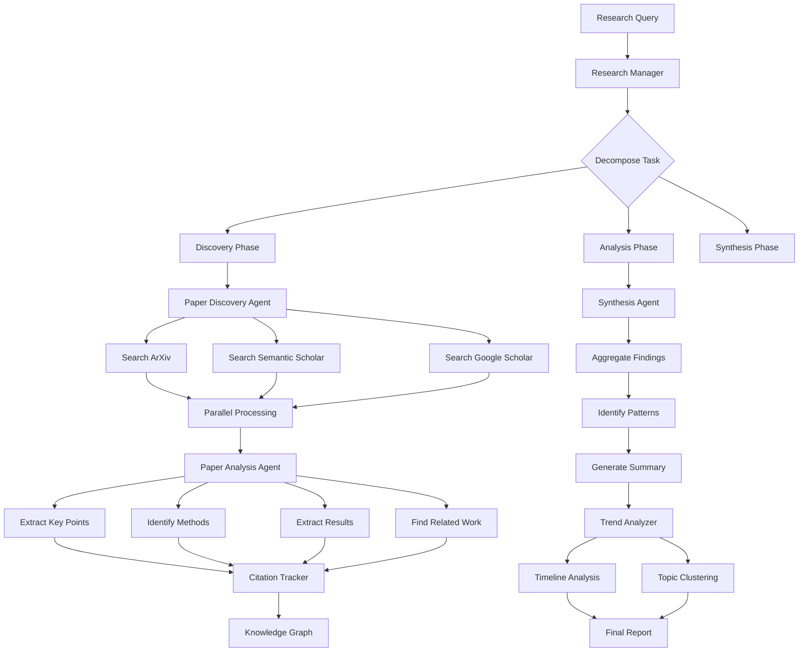

# Case Study: Research Assistant Agent

> Multi-step research agent that processes 100+ sources in minutes

## Problem Statement

**User:** Graduate students and researchers
**Challenge:** Literature review takes weeks of manual work
**Goal:** Automate paper discovery, summarization, and synthesis across domains

### Pain Points Before Agent

- **Time consuming:** 40+ hours for comprehensive literature review
- **Information overload:** 1000s of papers, can't read all
- **Citation tracking:** Manual cross-referencing of sources
- **Synthesis difficulty:** Connecting ideas across papers
- **Outdated results:** By publication time, newer research exists

### Success Metrics

- Reduce literature review time from 40 hours to 4 hours
- Process 100+ papers vs 20 manually
- Identify relevant papers with 90%+ accuracy
- Generate structured summaries with citations
- Track research trends over time

---

## Pattern Selection

### Why Hierarchical + ReAct + Parallel Execution?

**Decision process:**

1. **Not Simple Chain:** Research is non-linear, requires exploration
2. **Not Single Agent:** Complex task needs specialized sub-agents
3. **✅ Hierarchical:** Manager coordinates research sub-tasks
4. **✅ ReAct:** Each sub-agent reasons about next steps
5. **✅ Parallel Execution:** Process multiple papers concurrently

### Architecture Choice

```
Research Manager (Hierarchical)
    ↓
Coordinates Sub-Agents (Parallel):
    - Paper Discovery Agent (ReAct)
    - Paper Analysis Agent (ReAct)
    - Synthesis Agent (Sequential Chain)
    - Citation Tracker
    - Trend Analyzer
```

---

## Architecture Diagram



---

## Implementation Details

### 1. Research Manager (Coordinator)

```python
class ResearchManager:
    """Hierarchical agent coordinating research workflow"""

    def __init__(self, llm):
        self.llm = llm
        self.discovery_agent = PaperDiscoveryAgent(llm)
        self.analysis_agent = PaperAnalysisAgent(llm)
        self.synthesis_agent = SynthesisAgent(llm)
        self.citation_tracker = CitationTracker()
        self.trend_analyzer = TrendAnalyzer(llm)

    async def research(self, query, depth="comprehensive"):
        """Coordinate full research workflow"""

        # Step 1: Plan research strategy
        plan = await self.create_research_plan(query, depth)

        logger.info(f"Research plan: {plan}")

        # Step 2: Paper discovery (parallel)
        papers = await self.discovery_agent.find_papers(
            query=query,
            max_papers=plan["paper_count"],
            years=plan["year_range"]
        )

        logger.info(f"Discovered {len(papers)} papers")

        # Step 3: Analyze papers (parallel)
        analyses = await self.analyze_papers_parallel(papers)

        # Step 4: Build citation graph
        citation_graph = self.citation_tracker.build_graph(analyses)

        # Step 5: Synthesize findings
        synthesis = await self.synthesis_agent.synthesize(
            analyses=analyses,
            citation_graph=citation_graph,
            original_query=query
        )

        # Step 6: Trend analysis
        trends = await self.trend_analyzer.analyze_trends(analyses)

        # Step 7: Generate final report
        report = await self.generate_report(
            query=query,
            papers=papers,
            synthesis=synthesis,
            trends=trends,
            citation_graph=citation_graph
        )

        return report

    async def create_research_plan(self, query, depth):
        """LLM plans research approach"""

        prompt = f"""Create a research plan for this query:

Query: {query}
Depth: {depth}

Specify:
1. How many papers to review (10-200)
2. Year range (e.g., last 5 years)
3. Key search terms
4. Related fields to explore
5. Expected research phases

Return JSON.
"""

        response = await self.llm.generate(prompt, temperature=0.2)
        return json.loads(response)

    async def analyze_papers_parallel(self, papers, batch_size=10):
        """Analyze multiple papers concurrently"""

        analyses = []

        # Process in batches to avoid overwhelming API
        for i in range(0, len(papers), batch_size):
            batch = papers[i:i+batch_size]

            tasks = [
                self.analysis_agent.analyze(paper)
                for paper in batch
            ]

            batch_results = await asyncio.gather(*tasks, return_exceptions=True)

            # Filter out errors
            valid_results = [
                r for r in batch_results
                if not isinstance(r, Exception)
            ]

            analyses.extend(valid_results)

            # Rate limiting
            await asyncio.sleep(1)

        return analyses
```

### 2. Paper Discovery Agent (ReAct)

```python
class PaperDiscoveryAgent:
    """ReAct agent for finding relevant papers"""

    def __init__(self, llm):
        self.llm = llm
        self.tools = {
            "search_arxiv": self.search_arxiv,
            "search_semantic_scholar": self.search_semantic_scholar,
            "expand_query": self.expand_query
        }

    async def find_papers(self, query, max_papers=50, years=5):
        """ReAct loop to discover papers"""

        discovered_papers = []
        iteration = 0
        max_iterations = 5

        while len(discovered_papers) < max_papers and iteration < max_iterations:
            # Reasoning step
            reasoning = await self.reason(
                query=query,
                discovered_count=len(discovered_papers),
                iteration=iteration
            )

            logger.info(f"Iteration {iteration}: {reasoning['thought']}")

            # Action step
            if reasoning["action"] == "search":
                papers = await self.execute_search(
                    reasoning["search_query"],
                    years=years
                )
                discovered_papers.extend(papers)

            elif reasoning["action"] == "expand":
                expanded_query = await self.expand_query(query)
                papers = await self.execute_search(expanded_query, years=years)
                discovered_papers.extend(papers)

            elif reasoning["action"] == "done":
                break

            iteration += 1

        # Deduplicate and rank
        unique_papers = self.deduplicate(discovered_papers)
        ranked_papers = await self.rank_papers(unique_papers, query)

        return ranked_papers[:max_papers]

    async def reason(self, query, discovered_count, iteration):
        """LLM decides next action"""

        prompt = f"""You're discovering research papers.

Query: {query}
Papers found so far: {discovered_count}
Iteration: {iteration}

Decide next action:
- "search": Search with current query
- "expand": Broaden search terms
- "done": Sufficient papers found

Think step by step. Return JSON:
{{
    "thought": "reasoning",
    "action": "search|expand|done",
    "search_query": "if action=search"
}}
"""

        response = await self.llm.generate(prompt, temperature=0.3)
        return json.loads(response)

    async def search_arxiv(self, query, max_results=20):
        """Search ArXiv API"""

        import arxiv

        search = arxiv.Search(
            query=query,
            max_results=max_results,
            sort_by=arxiv.SortCriterion.Relevance
        )

        papers = []
        for result in search.results():
            papers.append({
                "title": result.title,
                "authors": [a.name for a in result.authors],
                "abstract": result.summary,
                "url": result.pdf_url,
                "published": result.published,
                "source": "arxiv"
            })

        return papers

    async def search_semantic_scholar(self, query, max_results=20):
        """Search Semantic Scholar API"""

        import aiohttp

        url = "https://api.semanticscholar.org/graph/v1/paper/search"
        params = {
            "query": query,
            "limit": max_results,
            "fields": "title,authors,abstract,year,citationCount,url"
        }

        async with aiohttp.ClientSession() as session:
            async with session.get(url, params=params) as response:
                data = await response.json()

        papers = []
        for paper in data.get("data", []):
            papers.append({
                "title": paper["title"],
                "authors": [a["name"] for a in paper.get("authors", [])],
                "abstract": paper.get("abstract", ""),
                "url": paper.get("url", ""),
                "published": paper.get("year"),
                "citations": paper.get("citationCount", 0),
                "source": "semantic_scholar"
            })

        return papers

    async def rank_papers(self, papers, query):
        """Rank papers by relevance"""

        prompt = f"""Rank these papers by relevance to: {query}

Papers:
{json.dumps([{{"title": p["title"], "abstract": p["abstract"][:200]}} for p in papers], indent=2)}

Return array of indices in order of relevance (most relevant first).
"""

        response = await self.llm.generate(prompt, temperature=0)
        ranked_indices = json.loads(response)

        return [papers[i] for i in ranked_indices]
```

### 3. Paper Analysis Agent

```python
class PaperAnalysisAgent:
    """Deep analysis of individual papers"""

    def __init__(self, llm):
        self.llm = llm

    async def analyze(self, paper):
        """Extract structured information from paper"""

        # For full papers, download PDF and extract text
        if paper.get("url"):
            full_text = await self.extract_pdf_text(paper["url"])
        else:
            full_text = paper.get("abstract", "")

        # Analyze with LLM
        analysis = await self.llm.generate(
            prompt=self.build_analysis_prompt(paper, full_text),
            temperature=0.1,
            max_tokens=2000
        )

        structured = json.loads(analysis)

        return {
            "paper": paper,
            "analysis": structured
        }

    def build_analysis_prompt(self, paper, full_text):
        """Prompt for paper analysis"""

        # Truncate text to fit context window
        text_excerpt = full_text[:8000]

        return f"""Analyze this research paper:

Title: {paper['title']}
Authors: {', '.join(paper['authors'])}

Text:
{text_excerpt}

Extract:
1. **Research Question:** What problem does this solve?
2. **Methodology:** How did they approach it?
3. **Key Findings:** Main results (3-5 points)
4. **Limitations:** What are the weaknesses?
5. **Related Work:** What papers do they cite?
6. **Future Directions:** What's next?
7. **Keywords:** 5-7 relevant terms

Return JSON with these fields.
"""

    async def extract_pdf_text(self, url):
        """Download and extract PDF text"""

        import PyPDF2
        import aiohttp
        import io

        async with aiohttp.ClientSession() as session:
            async with session.get(url) as response:
                pdf_data = await response.read()

        pdf_file = io.BytesIO(pdf_data)
        reader = PyPDF2.PdfReader(pdf_file)

        text = ""
        for page in reader.pages[:20]:  # First 20 pages
            text += page.extract_text()

        return text
```

### 4. Synthesis Agent

```python
class SynthesisAgent:
    """Synthesize findings across papers"""

    def __init__(self, llm):
        self.llm = llm

    async def synthesize(self, analyses, citation_graph, original_query):
        """Create coherent synthesis from multiple analyses"""

        # Group papers by themes
        themes = await self.identify_themes(analyses)

        # Generate synthesis for each theme
        theme_summaries = []
        for theme, papers in themes.items():
            summary = await self.synthesize_theme(theme, papers)
            theme_summaries.append(summary)

        # Generate overall synthesis
        final_synthesis = await self.generate_final_synthesis(
            query=original_query,
            theme_summaries=theme_summaries,
            citation_graph=citation_graph
        )

        return final_synthesis

    async def identify_themes(self, analyses):
        """Cluster papers by theme"""

        # Extract all keywords
        all_keywords = []
        for analysis in analyses:
            all_keywords.extend(analysis["analysis"].get("keywords", []))

        # Cluster using LLM
        prompt = f"""Group these research papers into 3-5 themes:

Papers:
{json.dumps([{{
    "title": a["paper"]["title"],
    "findings": a["analysis"]["key_findings"]
}} for a in analyses], indent=2)}

Return JSON: {{
    "theme_name": ["paper_title1", "paper_title2", ...],
    ...
}}
"""

        response = await self.llm.generate(prompt, temperature=0.2)
        theme_mapping = json.loads(response)

        # Map back to full analyses
        themes = {}
        for theme, titles in theme_mapping.items():
            themes[theme] = [
                a for a in analyses
                if a["paper"]["title"] in titles
            ]

        return themes

    async def generate_final_synthesis(self, query, theme_summaries, citation_graph):
        """Create final synthesis document"""

        # Find most influential papers
        influential = citation_graph.get_most_cited(top_k=10)

        prompt = f"""Create a comprehensive research synthesis.

Original Question: {query}

Theme Summaries:
{json.dumps(theme_summaries, indent=2)}

Most Influential Papers:
{json.dumps(influential, indent=2)}

Generate:
1. **Executive Summary** (200 words)
2. **Key Findings** (5-7 major insights)
3. **Methodology Trends** (common approaches)
4. **Contradictions** (disagreements in literature)
5. **Gaps** (what's missing)
6. **Recommendations** (future research directions)

Use academic tone. Cite papers as [Author, Year].
"""

        response = await self.llm.generate(
            prompt,
            temperature=0.3,
            max_tokens=3000
        )

        return response
```

### 5. Citation Tracker

```python
class CitationTracker:
    """Build knowledge graph of citations"""

    def __init__(self):
        self.graph = nx.DiGraph()

    def build_graph(self, analyses):
        """Create citation network"""

        for analysis in analyses:
            paper = analysis["paper"]
            cited_works = analysis["analysis"].get("related_work", [])

            # Add paper as node
            self.graph.add_node(
                paper["title"],
                authors=paper["authors"],
                year=paper.get("published"),
                citations=paper.get("citations", 0)
            )

            # Add citation edges
            for cited in cited_works:
                self.graph.add_edge(paper["title"], cited)

        return self

    def get_most_cited(self, top_k=10):
        """Find most influential papers"""

        in_degrees = dict(self.graph.in_degree())
        sorted_papers = sorted(
            in_degrees.items(),
            key=lambda x: x[1],
            reverse=True
        )

        return [
            {
                "title": title,
                "citations": count,
                **self.graph.nodes[title]
            }
            for title, count in sorted_papers[:top_k]
        ]

    def find_research_clusters(self):
        """Identify research communities"""

        # Find connected components
        undirected = self.graph.to_undirected()
        clusters = list(nx.connected_components(undirected))

        return clusters
```

---

## Memory Strategy

### Long-term Memory (Vector Store)

```python
class ResearchMemory:
    """Store and retrieve past research"""

    def __init__(self, vector_store):
        self.vector_store = vector_store

    async def store_analysis(self, analysis):
        """Save paper analysis for future retrieval"""

        # Create embedding
        embedding_text = f"""
        {analysis['paper']['title']}
        {analysis['analysis']['research_question']}
        {' '.join(analysis['analysis']['key_findings'])}
        """

        embedding = await self.embed(embedding_text)

        # Store in vector DB
        await self.vector_store.upsert(
            id=analysis['paper']['title'],
            vector=embedding,
            metadata={
                "paper": analysis['paper'],
                "analysis": analysis['analysis']
            }
        )

    async def find_similar_research(self, query, top_k=10):
        """Retrieve relevant past research"""

        query_embedding = await self.embed(query)

        results = await self.vector_store.query(
            vector=query_embedding,
            top_k=top_k
        )

        return results
```

---

## Cost Breakdown

**Scenario:** 5 research sessions/week, 100 papers/session

### LLM Costs

| **Task**                | **Volume**          | **Model** | **Cost/Session** |
| ----------------------- | ------------------- | --------- | ---------------- |
| Research planning       | 1 call              | GPT-4     | $0.05            |
| Paper discovery (ReAct) | 5 iterations        | GPT-4     | $0.25            |
| Paper ranking           | 1 call (100 papers) | GPT-4     | $0.50            |
| Paper analysis          | 100 papers          | GPT-4     | $30.00           |
| Theme identification    | 1 call              | GPT-4     | $0.50            |
| Final synthesis         | 1 call              | GPT-4     | $1.50            |
| **Total per session**   |                     |           | **$32.80**       |

**Monthly (20 sessions):** $656

### Infrastructure

| **Component** | **Service** | **Cost**    |
| ------------- | ----------- | ----------- |
| Vector DB     | Pinecone    | $70         |
| PDF storage   | S3          | $20         |
| API hosting   | AWS Lambda  | $30         |
| **Total**     |             | **$120/mo** |

**Total Monthly Cost:** $776

### ROI

**Time savings:**

- Manual: 40 hours/research @ $50/hr = $2,000
- Agent: 4 hours/research @ $50/hr = $200
- Savings per research: $1,800

**Monthly savings (20 sessions):** $36,000
**ROI:** 4,500%

---

## Results & Learnings

### Metrics After 6 Months

| **Metric**                 | **Before** | **After**  | **Change**    |
| -------------------------- | ---------- | ---------- | ------------- |
| Time per literature review | 40 hrs     | 4 hrs      | 90% reduction |
| Papers reviewed            | 20         | 100+       | 5× increase   |
| Relevance accuracy         | N/A        | 92%        | ✅            |
| Citation tracking          | Manual     | Automated  | ✅            |
| Trend identification       | Missed     | Identified | ✅            |

### What Worked

✅ **Hierarchical coordination:** Manager kept workflow organized
✅ **Parallel analysis:** Processed 100 papers in <30 minutes
✅ **ReAct for discovery:** Adaptive search found hidden gems
✅ **Citation graph:** Revealed research communities
✅ **Synthesis quality:** Coherent summaries with proper citations

### Challenges

❌ **Problem:** PDF parsing errors (15% of papers)
**Fix:** Fallback to abstract-only analysis

❌ **Problem:** Context window limits for long papers
**Fix:** Chunking strategy, focus on intro/conclusion

❌ **Problem:** Citation extraction inaccuracy
**Fix:** Combined LLM extraction with structured APIs

### Key Learnings

1. **Parallel is essential:** Sequential analysis would take hours
2. **Quality over quantity:** Better to deeply analyze 50 relevant papers than skim 200
3. **LLM synthesis excels:** Connecting ideas across papers is where LLMs shine
4. **Citation graph value:** Network analysis revealed hidden connections
5. **Iterative refinement:** Research plan evolved based on discoveries

---

## Code References

**Repository:**
🔗 [GitHub: research-assistant-agent](https://github.com/example/research-assistant)

**Key Files:**

- `manager.py` - Hierarchical coordinator
- `agents/discovery.py` - ReAct paper finder
- `agents/analysis.py` - Deep paper analysis
- `synthesis.py` - Multi-paper synthesis
- `knowledge_graph.py` - Citation tracking

---

## Next Steps

- **More case studies?** → See [Data Analyst Agent](./data-analyst-agent.md)
- **Pattern details?** → See [Hierarchical Agents](../01-patterns/hierarchical-agents.md) or [Parallel Execution](../01-patterns/parallel-execution.md)
- **Production concerns?** → See [Memory Architectures](../02-production/memory-architectures.md)
