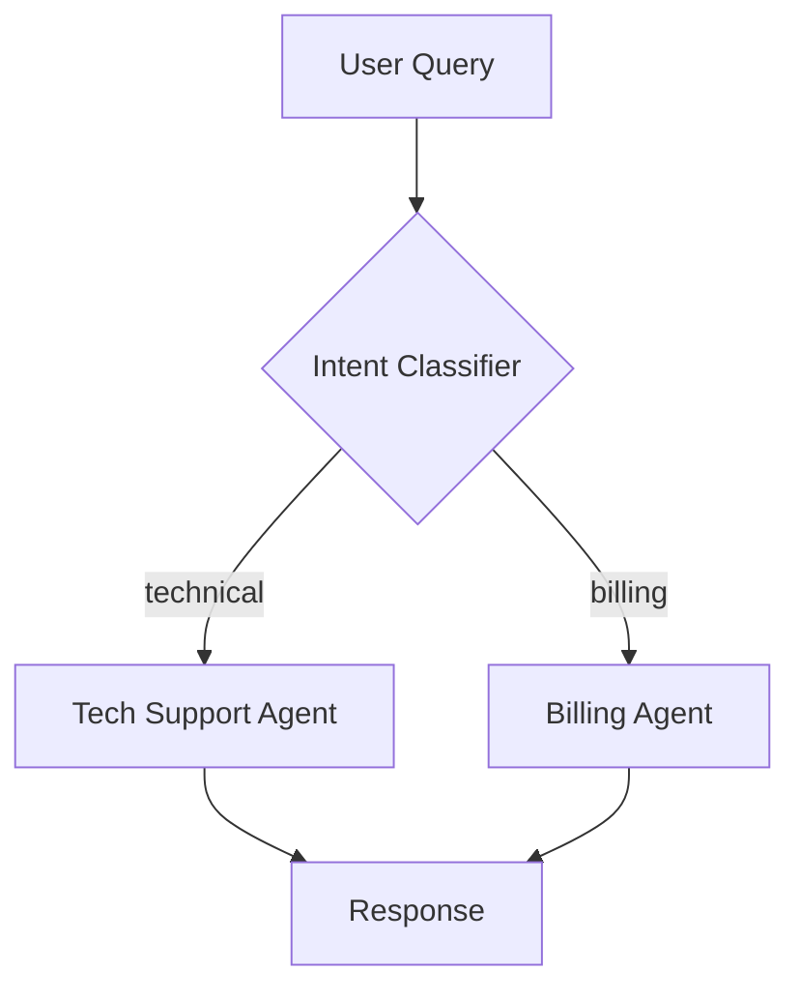

# Contributing to AI Agent Patterns & Architecture

> Help us build the most comprehensive guide to production AI agents

## 🎯 What We're Looking For

We welcome contributions that help developers build better AI agents:

### ✅ High-Value Contributions

- **New agent patterns** with production use cases
- **Case studies** with real metrics and learnings
- **Production lessons** from deployed systems
- **Framework comparisons** with benchmark data
- **Error patterns** and solutions
- **Cost optimization** techniques with savings data
- **Security vulnerabilities** and mitigations

### ⚠️ Review Carefully

- Theoretical patterns without implementation
- Framework tutorials (better suited for official docs)
- Duplicate content (check existing docs first)
- Opinion pieces without data

### ❌ Not Accepted

- Marketing content or product promotions
- AI-generated content without human review
- Plagiarized content
- Content violating our [Code of Conduct](#code-of-conduct)

---

## 📝 How to Contribute

### Option 1: Submit an Issue (Easiest)

**Best for:** Suggestions, questions, bug reports

1. Go to [Issues](https://github.com/devwithmohit/ai-agent-architecture-patterns/issues)
2. Check if your topic already exists
3. Create new issue with template:

```markdown
## Proposed Contribution

**Type:** [Pattern | Case Study | Comparison | Production Lesson]

**Topic:** Brief description

**Why it matters:** Value to readers

**Supporting data:** Metrics, benchmarks, citations

**Implementation:** Link to repo (if applicable)
```

---

### Option 2: Submit a Pull Request

**Best for:** Ready-to-merge content

#### Step 1: Fork & Clone

```bash
# Fork the repo on GitHub, then:
git clone https://github.com/YOUR_USERNAME/ai-agent-architecture-patterns.git
cd ai-agent-architecture-patterns
```

#### Step 2: Create Branch

```bash
git checkout -b feature/your-contribution-name
```

**Branch naming:**

- `feature/parallel-execution-pattern` (new pattern)
- `case-study/e-commerce-agent` (new case study)
- `fix/typo-in-react-pattern` (fixes)
- `update/cost-optimization-data` (updates)

#### Step 3: Make Changes

**Follow our structure:** See existing files for format

**For new patterns (01-patterns/):**

- When to Use / When NOT to Use
- Architecture diagram (Mermaid)
- Code examples (production-ready)
- Tradeoffs table
- Cost analysis
- Common pitfalls (6+)
- Real-world examples

**For case studies (04-case-studies/):**

- Problem statement with metrics
- Pattern selection rationale
- Full architecture diagram
- Implementation code
- Cost breakdown with ROI
- Results (before/after)
- What worked / didn't work
- Key learnings

#### Step 4: Test Your Changes

```bash
# Check markdown formatting
markdownlint *.md

# Validate links
markdown-link-check *.md

# Test Mermaid diagrams render
# (paste into https://mermaid.live)
```

#### Step 5: Commit

```bash
git add .
git commit -m "feat: add parallel execution pattern with case study"
```

**Commit message format:**

- `feat:` New feature/content
- `fix:` Bug fix, typo correction
- `update:` Update existing content
- `docs:` Documentation improvements

#### Step 6: Push & Create PR

```bash
git push origin feature/your-contribution-name
```

Then create Pull Request on GitHub with:

- Clear title and description
- Why this contribution matters
- Any supporting data/links
- Link to related issues

---

## 📐 Style Guide

### Markdown Formatting

**Headings:**

```markdown
# Main Title (H1 - once per file)

## Section (H2)

### Subsection (H3)
```

**Code blocks:**

````markdown
```python
# Always specify language
def example():
    return "production-ready code"
```
````

**Emphasis:**

- **Bold** for keywords, important concepts
- `code` for function names, variables, files
- _Italics_ sparingly for emphasis

### Writing Style

**✅ Do:**

- Write in active voice ("Use ReAct when..." not "ReAct can be used when...")
- Use concrete examples with numbers
- Include tradeoffs (honest assessment)
- Cite sources for claims
- Keep paragraphs short (3-4 sentences)

**❌ Don't:**

- Hype language ("amazing", "revolutionary")
- Vague claims ("significantly better")
- Tutorial-style step-by-step (unless case study)
- First-person ("I think", "we believe")

### Code Examples

**Requirements:**

- Production-ready (not toy examples)
- Include error handling
- Add comments for clarity
- Use type hints (Python)
- Show full imports

**Example:**

```python
from typing import List, Dict
import asyncio

async def execute_tools_parallel(
    tools: List[callable],
    max_concurrent: int = 5
) -> List[Dict]:
    """Execute multiple tools concurrently with rate limiting.

    Args:
        tools: List of async tool functions
        max_concurrent: Max parallel executions

    Returns:
        List of tool results
    """
    semaphore = asyncio.Semaphore(max_concurrent)

    async def limited_execute(tool):
        async with semaphore:
            try:
                return await tool()
            except Exception as e:
                logger.error(f"Tool {tool.__name__} failed: {e}")
                return {"error": str(e)}

    return await asyncio.gather(*[limited_execute(t) for t in tools])
```

### Diagrams

**Use Mermaid for:**

- Architecture diagrams
- Flow charts
- Decision trees
- Sequence diagrams

**Example:**



**Requirements:**

- Test in [mermaid.live](https://mermaid.live) before submitting
- Use clear labels
- Keep complexity manageable (max 15 nodes)

---

## 🎨 Content Standards

### Patterns (01-patterns/)

**Must include:**

1. Clear description (1-2 sentences)
2. When to use (3+ scenarios)
3. When NOT to use (3+ scenarios)
4. Architecture diagram
5. Implementation code (50-100 lines)
6. Tradeoffs table
7. Cost analysis with numbers
8. 6+ common pitfalls
9. Production considerations
10. References to papers/frameworks

**Length:** 150-250 lines of markdown

---

### Case Studies (04-case-studies/)

**Must include:**

1. Problem statement with metrics
2. Pattern selection (why this over others)
3. Full architecture diagram
4. Implementation details (3-5 key components)
5. Tools integrated
6. Cost breakdown (before/after)
7. Results with metrics
8. What worked + what didn't
9. Key learnings (5+)
10. Code references (GitHub link or inline)

**Length:** 300-500 lines of markdown

**Data requirements:**

- Real metrics (not estimates)
- ROI calculations
- Before/after comparisons
- Cost per month

---

### Comparisons (03-comparisons/)

**Must include:**

1. TL;DR decision matrix
2. Feature comparison table
3. When to choose each
4. Cost comparison (actual numbers)
5. Performance benchmarks
6. Migration paths
7. Real-world examples
8. Decision framework

**Length:** 200-300 lines

---

### Production Content (02-production/)

**Must include:**

1. Problem description
2. Multiple solutions (3+)
3. Tradeoffs for each
4. Code examples
5. Common pitfalls (6+)
6. Production checklist
7. Monitoring approaches
8. References

**Length:** 150-250 lines

---

## 🔍 Review Process

### What We Check

**Content:**

- ✅ Accurate technical information
- ✅ Production-ready code
- ✅ Real metrics and data
- ✅ Balanced perspective (pros/cons)
- ✅ Proper citations

**Format:**

- ✅ Follows style guide
- ✅ Markdown renders correctly
- ✅ Links work
- ✅ Diagrams render
- ✅ Code runs

**Value:**

- ✅ Fills gap in existing docs
- ✅ Practical and actionable
- ✅ Helps production developers

### Timeline

- **Initial review:** 2-3 days
- **Feedback provided:** If changes needed
- **Final review:** 1-2 days after updates
- **Merge:** Once approved

### Feedback

We may request:

- More detail in sections
- Additional code examples
- Metrics/data to support claims
- Restructuring for clarity
- Additional pitfalls or tradeoffs

---

## 🏆 Recognition

### Contributors

All contributors added to:

- `CONTRIBUTORS.md` file
- README acknowledgments
- Release notes (for major contributions)

### Featured Contributions

Exceptional contributions get:

- Social media shoutout
- Featured in newsletter
- Direct link in README

**Criteria:**

- Novel pattern with validation
- Comprehensive case study with metrics
- Significant production insights

---

## 📋 Checklist

Before submitting PR:

- [ ] Read existing content to avoid duplicates
- [ ] Follow file structure and naming
- [ ] Include all required sections
- [ ] Add code examples with error handling
- [ ] Create Mermaid diagrams (tested)
- [ ] Provide real metrics/data
- [ ] List 6+ common pitfalls
- [ ] Add references/citations
- [ ] Test all links
- [ ] Run markdown linter
- [ ] Write clear commit messages
- [ ] Create descriptive PR

---

## 🤝 Code of Conduct

### Our Standards

**Positive environment:**

- Respectful and inclusive language
- Welcoming diverse perspectives
- Constructive feedback
- Focus on learning and growth

**Unacceptable:**

- Harassment or discrimination
- Personal attacks
- Trolling or inflammatory comments
- Publishing others' private information

### Enforcement

Violations reported to: [mohitmahara40@gmail.com](mailto:mohitmahara40@gmail.com)

**Consequences:**

1. Warning
2. Temporary ban
3. Permanent ban

---

## 💬 Questions?

**Before submitting:**

- Check [existing issues](https://github.com/devwithmohit/ai-agent-architecture-patterns/issues)
- Review [FAQ section](../README.md)
- Search [closed PRs](https://github.com/devwithmohit/ai-agent-architecture-patterns/pulls?q=is%3Apr+is%3Aclosed)

**Still have questions?**

- Open a [GitHub Discussion](https://github.com/devwithmohit/ai-agent-architecture-patterns/discussions)
- Join [Discord community](https://discord.gg/langchain)
- Email: mohitmahara40@gmail.com

---

## 🚀 Quick Start for Contributors

**First time?**

1. **Find an issue:**

   - Look for `good-first-issue` label
   - Check `help-wanted` items

2. **Small contributions:**

   - Fix typos
   - Update outdated info
   - Add missing links
   - Improve code comments

3. **Build confidence:**
   - Start with small PRs
   - Learn the review process
   - Graduate to larger contributions

---

## 📚 Resources for Contributors

**Writing guides:**

- [Technical Writing One](https://developers.google.com/tech-writing/one)
- [Markdown Guide](https://www.markdownguide.org/)
- [Mermaid Documentation](https://mermaid.js.org/)

**Code standards:**

- [PEP 8](https://peps.python.org/pep-0008/) (Python)
- [Google Python Style Guide](https://google.github.io/styleguide/pyguide.html)

---

## 🎉 Thank You!

Every contribution helps developers build better AI agents. We appreciate your time and expertise.

**Let's make this the go-to resource for production AI agents!**

---

## Next Steps

- **Ready to contribute?** [Open an issue](https://github.com/devwithmohit/ai-agent-architecture-patterns/issues)
- **Join community?** [See Communities](./05-resources/communities.md)
- **Explore docs?** [Start here](./README.md)
